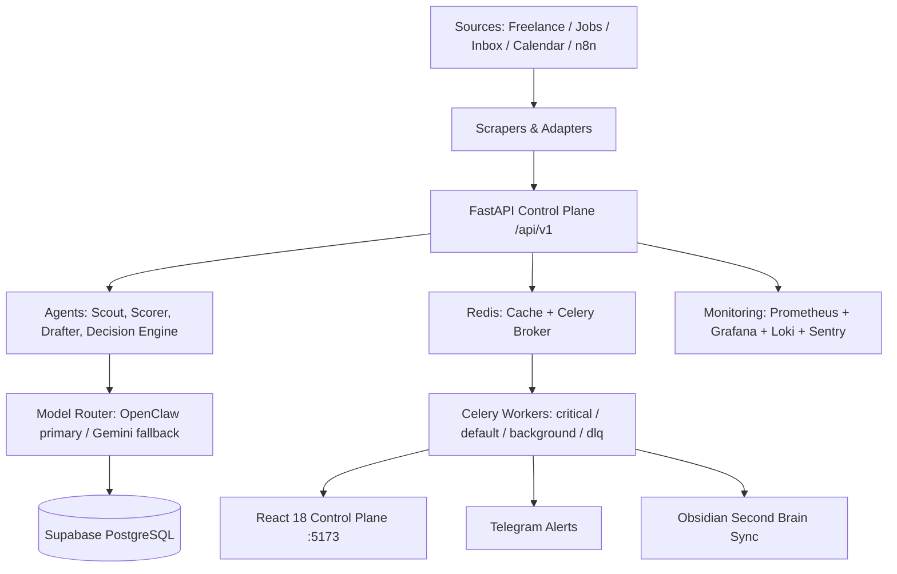

# Graxia OS — Personal AI Chief of Staff

<p align="center">
  
  
  
  
  
  
  
  
</p>

> **Find leads, draft outreach, manage approvals, and track revenue — autonomously, with human oversight at every decision.** Your personal sovereign OS for freelance, competition, and job pipelines.

<p align="center">
  <a href="#quickstart"></a>
  <a href="https://github.com/bravforcode/graxia-os/actions"></a>
  
  
</p>

---

### Demo

> **Docs/demo.gif placeholder — replace with 30s screen capture of control plane in action**

<p align="center">
  
  <br/>
  <em>Control plane: opportunities → drafts → approvals → tasks → costs → event bus (React 18 + FastAPI)</em>
</p>

```
# To add your demo:
# 1. Record 30s of http://localhost:5173 (opportunities → draft → approval)
# 2. Save as docs/demo.gif (optimize with gifsicle)
# 3. Commit — placeholder above will auto-resolve
```

---

### Why Graxia OS

Solo operators drown in leads, inboxes, and follow-ups. Graxia OS is a **control plane**, not a dashboard — it consolidates:

- **Discovery** from freelance boards, competitions, job sites, network leads, events
- **Scoring** via AI (fit / risk / effort / timing / next action) with cost-aware model routing
- **Execution** via Celery workers (scan, briefing, follow-up, email, backup, weekly review)
- **Knowledge** sync to Obsidian second brain — projects, contacts, tasks never leave your system

**342 commits · production shape via Docker Compose + Supabase · 15+ Grafana alerts**

---

### Architecture



**Stack:** FastAPI + SQLAlchemy async + Alembic + PostgreSQL/Supabase · Redis + Celery Beat · React 18 + TypeScript + Vite + Bun · Caddy + n8n · Prometheus/Grafana/Loki

---

### Quickstart (3 commands)

```bash
git clone https://github.com/bravforcode/graxia-os.git
cd graxia-os
cp .env.example .env  # set DATABASE_URL, SECRET_KEY, ADMIN_DEFAULT_EMAIL/PASSWORD
```

```bash
# Dev (with fallback without Postgres)
# Add USE_SQLITE_FALLBACK=true for offline dev
docker compose --env-file .env.dev -f config/docker-compose.dev.yml up
```

- API: http://localhost:8000 — docs at `/docs` · health at `/health` & `/api/v1/system/health`
- Frontend: http://localhost:5173
- n8n: http://localhost:5678

**Prod (Supabase always-on):**
```bash
cp .env.production.template .env.production  # fill ALL placeholders — strict validation
make supabase-preflight && make supabase-prod-migrate && make supabase-prod-up
```

Full runbook: [`docs/SUPABASE_PRODUCTION.md`](docs/SUPABASE_PRODUCTION.md)

---

### Features — What Operator Gets

| Capability | Detail |
|---|---|
| **Lead Discovery** | Multi-source scrapers + scheduled jobs + manual input |
| **AI Scoring** | Fit/risk/effort/timing with cheap/mid/high model tiers |
| **Draft & Follow-up** | Proposal drafts + briefing + follow-up with approval gate |
| **Revenue Pipeline** | Opportunities → Submissions → Email threads → Metrics |
| **Cost Control** | LLM usage ceilings + token tracking per tier |
| **Second Brain** | Obsidian daily note / weekly review / context sync |

---

### Results & Verification

- **Backend canonical tests:** `backend/tests/` (SQLite fallback for determinism, verified against PostgreSQL before prod)
- **Frontend:** lint + unit + e2e (Playwright) + Storybook + `bun run build`
- **Verification entry:**
  ```powershell
  .\verify.ps1        # Windows full
  make verify         # or make
  ```
- **OpenAPI:** `cd backend && python scripts/export_openapi.py --output openapi.json`

---

### Tech Stack (Badges)

| Layer | Tech |
|---|---|
| **Backend** | FastAPI · SQLAlchemy async · Alembic · JWT + CSRF + rate limit |
| **Data** | Supabase PostgreSQL · Redis · Celery Beat |
| **Frontend** | React 18 · TypeScript · Vite · Bun · Zustand · TanStack Query |
| **Infra** | Docker Compose · Caddy · n8n · Prometheus/Grafana/Loki/Flower |
| **AI** | OpenClaw (primary) · Gemini (fallback) · Model Router |

---

### Roadmap

- [x] Control plane + approval gates + Celery beat (daily backup, DLQ, scan, briefing)
- [ ] Live Google Workspace + Telegram + LLM verification on real creds
- [ ] Broaden E2E on live stack + Lighthouse/accessibility audit
- [ ] Rewrite `backend/tests_legacy/` against current `/api/v1`

---

### Contact

**Phirawit Jitnarong — Strategic Full-Stack & AI Engineer**
`nxme176@gmail.com` · `092-551-0427` · [LinkedIn](https://www.linkedin.com/in/%E0%B8%9E%E0%B8%B5%E0%B8%A3%E0%B8%A7%E0%B8%B4%E0%B8%8A%E0%B8%8D%E0%B9%8C-%E0%B8%88%E0%B8%B4%E0%B8%95%E0%B8%93%E0%B8%A3%E0%B8%87%E0%B8%84%E0%B9%8C-0000393a4) · [Fastwork](https://fastwork.co/user/bravforcode?source=search)

> Looking for a technical co-founder or full-time AI + Full-Stack hire? Let's build.
