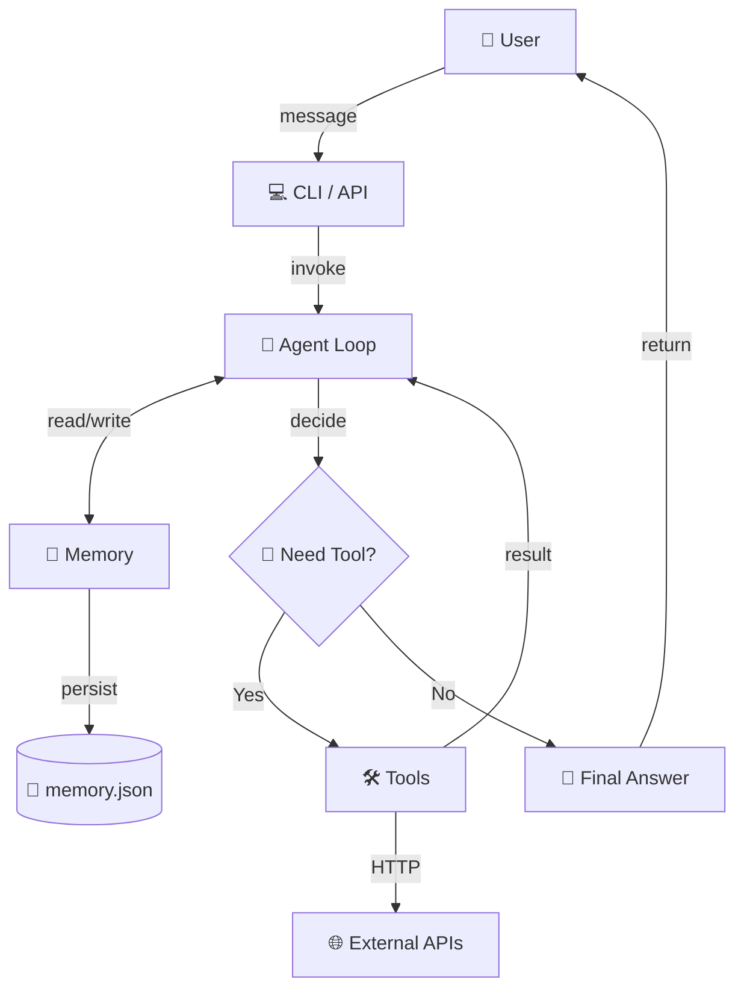

# ai-agent-starter-github delivery bundle

This bundle contains the original AI Factory delivery assets.
Source files are preserved below with their relative paths.

## Source: `downloads/10-ai-agent-starter-github/README.md`

```md
# AI Agent Starter 🚀
**Production-ready Python AI Agent — clone แล้วรันได้ใน 30 นาที**

> 🤖 ReAct agent pattern + tool calling + memory + multi-provider support  
> 🎯 เป้าหมาย: นักพัฒนา Python ที่อยากได้ AI agent ที่รันได้จริง ไม่ใช่แค่ demo  
> 💼 License: MIT — ใช้เชิงพาณิชย์ได้ ขายต่อได้ แก้ไขได้

---

## ✨ Features

- ✅ **ReAct Agent Loop** — reasoning + acting แบบ iterative
- ✅ **Multi-Provider** — รองรับ OpenAI, Anthropic, Google Gemini
- ✅ **Tool Calling** — เพิ่ม tools ได้ง่าย ๆ (มี 4 ตัวอย่าง)
- ✅ **Memory** — short-term (context) + long-term (JSON persistence)
- ✅ **Production-ready** — error handling, retry, logging
- ✅ **Minimal deps** — แค่ `requests` + provider SDK
- ✅ **No LangChain** — เขียนเอง เข้าใจง่าย แก้ไขง่าย ไม่ vendor lock-in

---

## 🏗️ Architecture



**Flow:**
1. User ส่งข้อความ
2. Agent loop คิด (Reasoning) — ตัดสินใจว่าต้องใช้ tool ไหม
3. ถ้าต้องใช้ tool → เรียก tool → ได้ผลลัพธ์ → กลับมาคิดต่อ
4. ถ้าไม่ต้องใช้ → ตอบคำตอบสุดท้าย
5. บันทึก conversation ลง memory

---

## 📋 Prerequisites

- Python 3.10+ ([ดาวน์โหลด](https://www.python.org/downloads/))
- pip (มาพร้อม Python)
- API key ของ LLM provider (เลือก 1 ตัว):
  - **OpenAI** (แนะนำ) — [สมัคร](https://platform.openai.com/api-keys)
  - **Anthropic Claude** — [สมัคร](https://console.anthropic.com/)
  - **Google Gemini** (ฟรี!) — [สมัคร](https://aistudio.google.com/app/apikey)

**ไม่ต้องมี GPU, ไม่ต้องมี server, ไม่ต้องมี Docker** (แต่ deploy ได้)

---

## 🚀 Quickstart (30 นาที)

### 1. Clone & Install (3 นาที)

```bash
git clone https://github.com/yourname/ai-agent-starter.git
cd ai-agent-starter
cd code
pip install -r requirements.txt
```

หรือใช้ venv (แนะนำ):
```bash
python -m venv venv
source venv/bin/activate  # Windows: venv\Scripts\activate
pip install -r requirements.txt
```

### 2. ตั้งค่า API Key (2 นาที)

```bash
cp .env.example .env
# แก้ .env ใส่ API key ของคุณ
```

`.env` ตัวอย่าง:
```bash
# เลือก provider เดียว (หรือใส่หลายตัวก็ได้)
OPENAI_API_KEY=sk-...
ANTHROPIC_API_KEY=sk-ant-...
GOOGLE_API_KEY=AIza...

# เลือก default provider
LLM_PROVIDER=openai
LLM_MODEL=gpt-4o-mini

# ตั้งค่า agent
AGENT_MAX_ITERATIONS=10
AGENT_TEMPERATURE=0.7
MEMORY_FILE=./memory.json
```

### 3. ทดสอบ (1 นาที)

```bash
python agent_loop.py
```

พิมพ์: `หาข้อมูล weather Bangkok` หรือ `คำนวณ 25 * 4 + 100`

### 4. รัน Demo (3 นาที)

```bash
# ใช้ system prompt สำหรับ Thai customer service
python agent_loop.py --system prompts/system-prompt.md
```

---

## 📁 Project Structure

```
ai-agent-starter/
├── README.md                  # ไฟล์นี้
├── ARCHITECTURE.md            # Deep dive: agent loop, tool use, memory
├── DEPLOY.md                  # Deploy บน Railway / Render / Fly.io
├── EXAMPLES.md                # ตัวอย่างการใช้งาน 3 แบบ
├── LICENSE                    # MIT
├── prompts/
│   └── system-prompt.md       # Thai customer-service agent prompt
└── code/
    ├── agent_loop.py          # Main agent loop (ReAct)
    ├── tools.py               # 4 sample tools
    ├── memory.py              # Memory management
    ├── requirements.txt       # Python deps
    ├── .env.example           # API key template
    └── tests/
        └── test_agent.py      # Unit tests
```

---

## 🛠️ Tools ที่มาพร้อม

| Tool | คำอธิบาย | ต้องการ |
|---|---|---|
| `web_search` | ค้นหาข้อมูลจากเว็บ | SerpAPI key (ฟรี 100/เดือน) |
| `calculator` | คำนวณเลข (พร้อม sympy สำหรับ complex) | ไม่ต้อง |
| `read_file` | อ่านไฟล์ในเครื่อง | ไม่ต้อง |
| `send_email` | ส่งอีเมล | SMTP credentials |

**เพิ่ม tool ใหม่:** ดู template ใน `tools.py` แล้วเพิ่ม function ใหม่ + register ใน `TOOL_REGISTRY`

---

## 💬 ตัวอย่างการใช้งาน

### Basic CLI
```bash
$ python agent_loop.py

🤖 AI Agent (OpenAI gpt-4o-mini)
พิมพ์ 'exit' เพื่อออก
พิมพ์ 'clear' เพื่อลบ memory

You: หวัดดี
Agent: สวัสดีครับ! มีอะไรให้ช่วยไหมครับ?

You: คำนวณงบประมาณโครงการ 1,500,000 บาท ถ้าแบ่งจ่าย 12 งวด
Agent: ใช้ tool: calculator({"expression": "1500000 / 12"})
Tool result: 125000
Agent: 1,500,000 บาท ถ้าแบ่งเป็น 12 งวด จะตกงวดละ 125,000 บาทครับ

You: exit
Agent: ขอบคุณที่ใช้บริการ! 👋
```

### As a Library
```python
from agent_loop import Agent
from tools import TOOL_REGISTRY
from memory import Memory

memory = Memory(persist_path="./memory.json")
agent = Agent(
    provider="openai",
    model="gpt-4o-mini",
    system_prompt="คุณเป็น AI ผู้ช่วยอัจฉริยะ",
    tools=TOOL_REGISTRY,
    memory=memory
)

response = agent.run("อธิบาย quantum computing แบบเข้าใจง่าย")
print(response)
```

### As a REST API
```python
# app.py
from flask import Flask, request, jsonify
from agent_loop import Agent

app = Flask(__name__)
agent = Agent(...)

@app.route("/chat", methods=["POST"])
def chat():
    user_id = request.json.get("user_id")
    message = request.json.get("message")
    response = agent.run(message, user_id=user_id)
    return jsonify({"response": response})

if __name__ == "__main__":
    app.run(host="0.0.0.0", port=8000)
```

ดูตัวอย่าง deploy ใน `DEPLOY.md`

---

## 🧪 Testing

```bash
cd code
pytest tests/
```

หรือรัน manual:
```bash
python tests/test_agent.py
```

Tests ครอบคลุม:
- ✅ Agent loop basic
- ✅ Tool calling
- ✅ Memory persistence
- ✅ Error handling
- ✅ Multi-provider switching

---

## 🎓 เรียนรู้เพิ่มเติม

- **[ARCHITECTURE.md](./ARCHITECTURE.md)** — Deep dive เบื้องหลัง agent loop
- **[EXAMPLES.md](./EXAMPLES.md)** — 3 ตัวอย่างการใช้งานจริง
- **[DEPLOY.md](./DEPLOY.md)** — Deploy production
- **[prompts/system-prompt.md](./prompts/system-prompt.md)** — Production-ready system prompt

---

## 🤝 Contributing

PR ยินดีต้อนรับ! โปรด:
1. Fork repo
2. สร้าง feature branch (`git checkout -b feature/AmazingFeature`)
3. Commit (`git commit -m 'Add: amazing feature'`)
4. Push (`git push origin feature/AmazingFeature`)
5. เปิด Pull Request

---

## 📜 License

MIT License — ใช้เชิงพาณิชย์ได้ ขายต่อได้ แก้ไขได้

---

## 💬 Support

- 📧 Email: support@aifactory.co
- 🐛 Issues: https://github.com/yourname/ai-agent-starter/issues
- 💬 Discord: "AI Builders Thailand"

---

**Built with ❤️ for the AI builder community — June 2026**
```

## Source: `downloads/10-ai-agent-starter-github/ARCHITECTURE.md`

```md
# Architecture Deep Dive
**เบื้องหลัง AI Agent — ทำไมถึงทำงานได้**

> 📐 เอกสารนี้สำหรับคนอยากเข้าใจ **ทำไม** ไม่ใช่แค่ **ทำอย่างไร**  
> 🎯 หลังอ่านจบ คุณจะสามารถแก้ไข/ขยาย agent ได้อย่างมั่นใจ

---

## สารบัญ

- [1. Agent Loop (ReAct Pattern)](#1-react)
- [2. Tool Use](#2-tools)
- [3. Memory Architecture](#3-memory)
- [4. Planning & Reasoning](#4-planning)
- [5. Multi-Provider Support](#5-providers)
- [6. Error Handling & Retry](#6-errors)
- [7. Performance & Cost](#7-perf)

---

<a id="1-react"></a>
## 1. Agent Loop (ReAct Pattern)

**ReAct** = **Rea**soning + **Act**ing — สลับกันไปเรื่อย ๆ จนกว่าจะได้คำตอบสุดท้าย

### 1.1 Pseudocode

```python
def agent_loop(user_message, max_iter=10):
    memory.append({"role": "user", "content": user_message})
    
    for iteration in range(max_iter):
        # 1. Reasoning — ให้ LLM คิด
        response = llm.complete(memory + tools_schema)
        
        # 2. Decision — LLM ตอบ: ใช้ tool หรือตอบตรง
        if response.has_tool_call():
            tool_name = response.tool_call.name
            tool_args = response.tool_call.args
            
            # 3. Acting — เรียก tool จริง
            tool_result = tools[tool_name](**tool_args)
            
            # 4. Observation — บันทึกผลลัพธ์
            memory.append({
                "role": "tool",
                "name": tool_name,
                "content": tool_result
            })
        else:
            # 5. Final answer — จบ loop
            memory.append({"role": "assistant", "content": response.text})
            return response.text
    
    # ถ้าเกิน max_iter → force answer
    return "หมดเวลา กรุณาถามใหม่"
```

### 1.2 ตัวอย่างจริง

**Input:** "อากาศวันนี้ที่กรุงเทพเป็นยังไง?"

**Iteration 1:**
```
[Reasoning]
- ผู้ใช้ถามอากาศ → ต้องใช้ web_search
[Action]
- Tool: web_search(query="weather Bangkok today")
[Observation]
- "กรุงเทพ 32°C ฝนตก 60%"
```

**Iteration 2:**
```
[Reasoning]
- ได้ข้อมูลแล้ว → ตอบได้เลย
[Final Answer]
- "วันนี้กรุงเทพอากาศร้อน 32°C มีฝนตก 60% ควรพกร่มด้วยนะครับ"
```

### 1.3 ทำไมต้อง ReAct ไม่ใช่แค่ Chain-of-Thought?

| Pattern | ข้อดี | ข้อเสีย |
|---|---|---|
| **Zero-shot** | เร็ว, ถูก | ตอบผิดบ่อย (fact hallucination) |
| **Chain-of-Thought** | คิดดีขึ้น | ยัง hallucinate ได้ |
| **ReAct** | คิดดี + ใช้ข้อมูลจริง | แพงกว่า (multiple LLM calls) |
| **Reflexion** | เรียนรู้จาก error | ซับซ้อน, ช้ามาก |

**ReAct เป็น sweet spot** — คุณภาพสูง + ราคาสมเหตุสมผล

### 1.4 Max Iterations — ตั้งเท่าไหร่?

- **1-3:** งานง่าย (Q&A, lookup)
- **5-10:** งานกลาง (research, multi-step)
- **10-20:** งานซับซ้อน (planning, multi-tool)
- **>20:** อันตราย — agent อาจ loop ไม่จบ

**ค่า default ของเรา: 10** (ปรับได้ใน `.env`)

---

<a id="2-tools"></a>
## 2. Tool Use

### 2.1 Tool Schema (OpenAI format)

LLM ต้องรู้ว่ามี tool อะไรบ้าง → เราส่ง schema ไปแบบนี้:

```json
{
  "type": "function",
  "function": {
    "name": "web_search",
    "description": "ค้นหาข้อมูลจาก Google — ใช้เมื่อต้องการข้อมูลล่าสุด",
    "parameters": {
      "type": "object",
      "properties": {
        "query": {
          "type": "string",
          "description": "คำค้นหา (ภาษาไทยหรืออังกฤษก็ได้)"
        },
        "num_results": {
          "type": "integer",
          "description": "จำนวนผลลัพธ์ (default 5)",
          "default": 5
        }
      },
      "required": ["query"]
    }
  }
}
```

**Key points:**
- `description` ต้องชัดเจน — LLM ใช้ตัดสินใจว่าจะเรียก tool นี้เมื่อไหร่
- `parameters` ต้องมี `type` + `description` ครบ
- `required` ระบุว่าตัวไหนจำเป็น

### 2.2 Tool Execution Flow

```python
# 1. LLM ตอบกลับมา
response = {
  "tool_calls": [{
    "id": "call_abc",
    "function": {
      "name": "web_search",
      "arguments": '{"query": "weather Bangkok"}'
    }
  }]
}

# 2. Parse
tool_name = response.tool_calls[0].function.name
tool_args = json.loads(response.tool_calls[0].function.arguments)

# 3. Execute
if tool_name in TOOL_REGISTRY:
    result = TOOL_REGISTRY[tool_name](**tool_args)
else:
    result = f"Error: Tool {tool_name} not found"

# 4. Send back to LLM
messages.append({
    "role": "tool",
    "tool_call_id": "call_abc",
    "content": str(result)
})
```

### 2.3 เพิ่ม Tool ใหม่ — Template

```python
def my_custom_tool(param1: str, param2: int = 10) -> str:
    """
    คำอธิบายสั้น ๆ ว่า tool นี้ทำอะไร
    
    Args:
        param1: คำอธิบาย param 1
        param2: คำอธิบาย param 2 (default 10)
    
    Returns:
        ผลลัพธ์เป็น string
    """
    # Logic here
    result = do_something(param1, param2)
    return f"Result: {result}"

# Register
TOOL_REGISTRY["my_custom_tool"] = {
    "function": my_custom_tool,
    "schema": {
        "type": "function",
        "function": {
            "name": "my_custom_tool",
            "description": "คำอธิบายสำหรับ LLM",
            "parameters": {
                "type": "object",
                "properties": {
                    "param1": {"type": "string", "description": "..."},
                    "param2": {"type": "integer", "description": "...", "default": 10}
                },
                "required": ["param1"]
            }
        }
    }
}
```

**Best practices:**
- ✅ Return `str` เสมอ (LLM อ่าน string ได้ดีที่สุด)
- ✅ Handle errors → return error message เป็น string
- ✅ เขียน description ให้ LLM เข้าใจ → ไม่งั้น LLM ไม่รู้จะเรียกเมื่อไหร่
- ✅ Test ทุก tool ก่อน production

### 2.4 Tool Safety

**⚠️ อันตราย:**
- Tool ที่ลบไฟล์ → ต้องมี confirmation
- Tool ที่ส่งอีเมล → ต้อง rate limit
- Tool ที่เรียก API เสียเงิน → ต้อง cap cost

**Pattern: Sandbox**

```python
def dangerous_tool(path: str) -> str:
    # Whitelist directory
    allowed_dir = "/Users/agent/sandbox/"
    if not path.startswith(allowed_dir):
        return f"Error: Access denied. Only {allowed_dir} allowed"
    
    # Cap file size
    if os.path.getsize(path) > 10_000_000:  # 10MB
        return "Error: File too large"
    
    # Proceed
    with open(path) as f:
        return f.read()
```

---

<a id="3-memory"></a>
## 3. Memory Architecture

### 3.1 Two-Tier Memory

```
┌──────────────────────────────────────┐
│ Short-term (in-RAM, current session) │ ← message list
│ - System prompt                      │
│ - User messages                      │
│ - Assistant messages                 │
│ - Tool calls + results               │
└──────────────────────────────────────┘
              ↕ flush
┌──────────────────────────────────────┐
│ Long-term (disk, persistent)         │ ← memory.json
│ - Conversation history (per user)    │
│ - User preferences                   │
│ - Past tool results                  │
└──────────────────────────────────────┘
```

### 3.2 Short-term (Context Window)

```python
class Memory:
    def __init__(self, system_prompt: str, max_tokens: int = 8000):
        self.messages = [{"role": "system", "content": system_prompt}]
        self.max_tokens = max_tokens
    
    def add(self, role: str, content: str, **kwargs):
        self.messages.append({"role": role, "content": content, **kwargs})
        self._trim()
    
    def _trim(self):
        # ถ้า context ยาวเกิน → ลบข้อความเก่าสุด (ยกเว้น system)
        while self._estimate_tokens() > self.max_tokens:
            if len(self.messages) <= 2:  # system + last user
                break
            self.messages.pop(1)  # remove oldest (after system)
```

**ทำไมต้อง trim?**
- GPT-4o context = 128K tokens
- แต่ input แพง (~$5/1M tokens)
- และ LLM อาจ "ลืม" ข้อความตรงกลาง (Lost-in-the-Middle)

**Token estimation:**
```python
def estimate_tokens(text: str) -> int:
    # Approximate: 1 token ≈ 4 chars (English), 1.5 chars (Thai)
    thai_chars = sum(1 for c in text if 'ก' <= c <= '๛')
    other_chars = len(text) - thai_chars
    return int(thai_chars / 1.5 + other_chars / 4)
```

### 3.3 Long-term (Persistence)

```python
{
  "users": {
    "user_123": {
      "preferences": {
        "language": "th",
        "tone": "casual"
      },
      "history": [
        {"timestamp": "...", "user": "...", "assistant": "..."},
        ...
      ]
    }
  }
}
```

**When to save:**
- ทุกครั้งที่จบ conversation
- หรือทุก ๆ 10 messages (batch save)

**When to load:**
- ตอน user ใหม่เริ่ม session
- หรือทุก ๆ 5 minutes

### 3.4 Vector Memory (RAG — Optional)

สำหรับ agent ที่ต้อง **จำข้อมูลจำนวนมาก**:

```python
# ใช้ FAISS / ChromaDB
from sentence_transformers import SentenceTransformer
import faiss

class VectorMemory:
    def __init__(self):
        self.encoder = SentenceTransformer('paraphrase-multilingual-MiniLM-L12-v2')
        self.index = faiss.IndexFlatL2(384)
        self.documents = []
    
    def add(self, doc: str):
        embedding = self.encoder.encode([doc])
        self.index.add(embedding)
        self.documents.append(doc)
    
    def search(self, query: str, k: int = 3) -> list[str]:
        embedding = self.encoder.encode([query])
        distances, indices = self.index.search(embedding, k)
        return [self.documents[i] for i in indices[0]]
```

**ตัวอย่างการใช้:**
- User: "เมื่อวานเราคุยเรื่องอะไร"
- Vector search → "คุยเรื่อง..."

---

<a id="4-planning"></a>
## 4. Planning & Reasoning

### 4.1 Chain-of-Thought Prompting

```python
SYSTEM_PROMPT = """คุณเป็น AI agent อัจฉริยะ
เมื่อได้รับคำถาม ให้คิดเป็นขั้นตอน:

Thought: [คิดว่าต้องทำอะไร]
Action: [เลือก tool ที่จะใช้ หรือ "Final Answer" ถ้าพอใจแล้ว]
Action Input: [arguments สำหรับ tool]
Observation: [ผลลัพธ์ที่ได้]
... (ทำซ้ำ)
Final Answer: [คำตอบสุดท้าย]
"""
```

### 4.2 Plan-and-Execute Pattern

แทนที่จะให้ agent ทำทีละขั้น → ให้คิดแผนก่อน:

```python
# Step 1: Plan
plan = llm.complete(f"""
สร้างแผน 5 ขั้นตอนเพื่อตอบ: {user_message}
Output JSON array
""")

# Step 2: Execute each step
for step in plan:
    result = execute_step(step)
    
# Step 3: Synthesize
final = llm.complete(f"สรุปผลจาก: {results}")
```

**เปรียบเทียบ:**

| Pattern | เหมาะกับ | ข้อเสีย |
|---|---|---|
| ReAct | งานไม่แน่นอน, ต้องปรับตัว | ใช้ token เยอะ |
| Plan-and-Execute | งานชัดเจน, เป็นขั้นเป็นตอน | ถ้าแผนผิด → ทำใหม่หมด |
| Hybrid (default) | ใช้ได้ทั่วไป | ซับซ้อนกว่า |

---

<a id="5-providers"></a>
## 5. Multi-Provider Support

### 5.1 Why Multi-Provider?

- **Cost optimization** — ใช้ gpt-4o-mini สำหรับงานง่าย, gpt-4o สำหรับงานยาก
- **Fallback** — ถ้า OpenAI down → ใช้ Anthropic
- **Best-of-breed** — GPT-4o ดีที่ vision, Claude ดีที่ reasoning

### 5.2 Unified Interface

```python
class LLMProvider(ABC):
    @abstractmethod
    def complete(self, messages: list, tools: list = None) -> Response:
        pass

class OpenAIProvider(LLMProvider):
    def complete(self, messages, tools=None):
        # Call OpenAI API
        ...

class AnthropicProvider(LLMProvider):
    def complete(self, messages, tools=None):
        # Call Anthropic API
        ...

class GeminiProvider(LLMProvider):
    def complete(self, messages, tools=None):
        # Call Gemini API
        ...
```

### 5.3 Switching in Code

```python
provider = "openai"  # or "anthropic" or "google"
model = "gpt-4o-mini"

if provider == "openai":
    llm = OpenAIProvider(api_key=os.getenv("OPENAI_API_KEY"), model=model)
elif provider == "anthropic":
    llm = AnthropicProvider(api_key=os.getenv("ANTHROPIC_API_KEY"), model=model)
elif provider == "google":
    llm = GeminiProvider(api_key=os.getenv("GOOGLE_API_KEY"), model=model)
```

### 5.4 Provider Quirks

| Feature | OpenAI | Anthropic | Google |
|---|---|---|---|
| Function calling | ✅ | ✅ (tools) | ✅ |
| Vision | ✅ | ✅ | ✅ |
| Streaming | ✅ | ✅ | ✅ |
| JSON mode | ✅ | ✅ (via prompt) | ✅ |
| Max context | 128K | 200K | 1M |
| Thai support | ดี | ดีมาก | ดี |

**คำแนะนำ:**
- เริ่มต้น: **OpenAI gpt-4o-mini** (ถูก, เร็ว, work well)
- Reasoning หนัก ๆ: **Anthropic Claude 3.5 Sonnet** (เก่ง reasoning, Thai ดี)
- ฟรี: **Google Gemini 1.5 Flash** (ฟรี 1M token/วัน, Thai OK)

---

<a id="6-errors"></a>
## 6. Error Handling & Retry

### 6.1 Failure Modes

| Error | สาเหตุ | แก้ |
|---|---|---|
| LLM timeout | API ช้า | Retry with backoff |
| Rate limit | เรียกเยอะเกินไป | Queue + delay |
| Invalid JSON | LLM ตอบผิด format | Retry with stronger prompt |
| Tool not found | LLM เรียก tool ที่ไม่มี | Return error to LLM |
| Tool timeout | Tool ใช้เวลานาน | Cap timeout 30s |
| Max iterations | Loop ไม่จบ | Force final answer |

### 6.2 Retry Decorator

```python
import time
from functools import wraps

def retry(max_attempts=3, backoff=2):
    def decorator(func):
        @wraps(func)
        def wrapper(*args, **kwargs):
            for attempt in range(max_attempts):
                try:
                    return func(*args, **kwargs)
                except Exception as e:
                    if attempt == max_attempts - 1:
                        raise
                    wait = backoff ** attempt
                    print(f"Retry {attempt+1}/{max_attempts} after {wait}s: {e}")
                    time.sleep(wait)
        return wrapper
    return decorator

@retry(max_attempts=3, backoff=2)
def call_llm(messages):
    return openai_client.chat.completions.create(...)
```

### 6.3 Graceful Degradation

```python
def safe_tool_execution(tool_func, **kwargs):
    try:
        result = tool_func(**kwargs)
        return {"success": True, "result": result}
    except TimeoutError:
        return {"success": False, "error": "Tool took too long"}
    except Exception as e:
        return {"success": False, "error": str(e)}
```

---

<a id="7-perf"></a>
## 7. Performance & Cost

### 7.1 Cost Estimate (gpt-4o-mini)

| Scenario | Tokens (in + out) | Cost (USD) | Cost (THB) |
|---|---|---|---|
| Simple Q&A | 500 + 100 | $0.0001 | ~0.004 บาท |
| With 1 tool call | 1,500 + 200 | $0.0003 | ~0.01 บาท |
| Multi-step (5 iter) | 5,000 + 500 | $0.001 | ~0.04 บาท |
| Heavy use (100/day) | - | $0.10/day | ~3.5 บาท/วัน |
| Heavy use (3000/mo) | - | $3/mo | ~105 บาท/เดือน |

**คำแนะนำ:**
- ใช้ gpt-4o-mini สำหรับ 80% ของงาน
- ใช้ gpt-4o เฉพาะงานที่ต้อง reasoning หนัก
- Cache results (ถ้าถามเหมือนเดิม ไม่ต้องเรียก LLM)

### 7.2 Latency

| Operation | Time |
|---|---|
| LLM call (gpt-4o-mini) | 0.5-2s |
| Tool execution | 0.1-5s |
| Token estimation | <10ms |
| JSON parsing | <10ms |
| **Total per iteration** | **1-7s** |
| **Full conversation (5 iter)** | **5-35s** |

### 7.3 Optimization Tips

1. **Stream responses** — user เห็นคำตอบทีละคำ เร็วขึ้น
2. **Parallel tool calls** — ถ้า agent เรียก 2 tools ที่ไม่ depend กัน
3. **Cache** — `lru_cache` สำหรับ tool results
4. **Smaller models** — ใช้ gpt-4o-mini แทน gpt-4o ถ้าไม่จำเป็น
5. **Context compression** — สรุป context เก่าแทนการเก็บทั้งหมด

---

## 🎓 เรียนรู้เพิ่ม

- [ReAct Paper](https://arxiv.org/abs/2210.03629) — ต้นฉบับ paper
- [OpenAI Function Calling](https://platform.openai.com/docs/guides/function-calling)
- [Anthropic Tool Use](https://docs.anthropic.com/claude/docs/tool-use)
- [LangChain Agents](https://python.langchain.com/docs/modules/agents/) — สำหรับคนอยากใช้ framework
- [Haystack](https://haystack.deepset.ai/) — alternative

---

**อ่านจบแล้ว? ลองแก้ code ใน `code/agent_loop.py` แล้วรันดู! 🚀**
```

## Source: `downloads/10-ai-agent-starter-github/DEPLOY.md`

```md
# Deployment Guide
**Deploy AI Agent ของคุณบน Cloud — ฟรี/ถูก พร้อม scale**

> 🚀 คู่มือ deploy บน 3 platforms: Railway, Render, Fly.io  
> 💰 เปรียบเทียบราคา + ข้อดีข้อเสีย

---

## Quick Decision Tree

```
ต้องการอะไร?
│
├─ ง่ายสุด + เร็วสุด → Railway (deploy ใน 5 นาที)
│
├─ ฟรี 100% → Render Free Tier (sleep หลัง 15 นาที idle)
│
├─ Control เต็มที่ + Multi-region → Fly.io
│
└─ Self-host → VPS (DigitalOcean, Hetzner, AWS EC2)
```

---

## Option 1: Railway (แนะนำ — ง่ายสุด)

**เวลา deploy: 5 นาที**  
**ราคา: $5/mo (~175 บาท) — Starter plan**

### Step 1: เตรียม GitHub Repo
```bash
cd ai-agent-starter
git init
git add .
git commit -m "Initial commit"
gh repo create ai-agent-starter --public --source=. --push
```

### Step 2: Deploy บน Railway
1. ไปที่ https://railway.app → Sign up with GitHub
2. คลิก "New Project" → "Deploy from GitHub repo"
3. เลือก `ai-agent-starter`
4. Railway จะ detect Python อัตโนมัติ

### Step 3: ตั้งค่า Environment
ใน Railway dashboard → Variables:
```
OPENAI_API_KEY=sk-...
LLM_PROVIDER=openai
LLM_MODEL=gpt-4o-mini
PORT=8000
```

### Step 4: เพิ่ม Procfile
สร้างไฟล์ `Procfile`:
```
web: cd code && python app.py
```

### Step 5: Deploy
Railway จะ deploy อัตโนมัติ → ได้ URL: `https://your-app.railway.app`

**ทดสอบ:**
```bash
curl https://your-app.railway.app/health
# {"status": "ok"}
```

**Cost:**
- Starter: $5/mo + usage (~175 บาท/เดือน)
- Light traffic (1,000 requests/day) = ~$5-10/mo
- Heavy traffic (10,000 requests/day) = ~$20-50/mo

---

## Option 2: Render (ฟรี tier)

**เวลา deploy: 10 นาที**  
**ราคา: $0 (free) / $7/mo (paid)**

### Step 1: สร้าง `render.yaml`
```yaml
services:
  - type: web
    name: ai-agent
    env: python
    plan: free
    buildCommand: "cd code && pip install -r requirements.txt"
    startCommand: "cd code && python app.py"
    envVars:
      - key: OPENAI_API_KEY
        sync: false
      - key: LLM_PROVIDER
        value: openai
      - key: LLM_MODEL
        value: gpt-4o-mini
```

### Step 2: Deploy
1. ไปที่ https://render.com → Sign up
2. New → Blueprint
3. Connect GitHub repo
4. Render จะ deploy ตาม `render.yaml`

**ข้อจำกัด Free tier:**
- Sleep หลัง idle 15 นาที
- Cold start ~30 วินาที
- 750 ชม./เดือน (พอใช้)

**ถ้าต้องการไม่ sleep:** Plan $7/mo

---

## Option 3: Fly.io (Multi-region)

**เวลา deploy: 15 นาที**  
**ราคา: Free tier + $1.94/mo สำหรับ 1 VM**

### Step 1: Install flyctl
```bash
# macOS
brew install flyctl

# Windows
iwr https://fly.io/install.ps1 -useb | iex

# Linux
curl -L https://fly.io/install.sh | sh
```

### Step 2: สร้าง Dockerfile
```dockerfile
FROM python:3.11-slim

WORKDIR /app
COPY code/requirements.txt .
RUN pip install --no-cache-dir -r requirements.txt

COPY code/ .
COPY prompts/ ./prompts/

EXPOSE 8000
CMD ["python", "app.py"]
```

### Step 3: Deploy
```bash
fly auth signup
fly launch
fly secrets set OPENAI_API_KEY=sk-...
fly deploy
```

**ได้ URL:** `https://ai-agent.fly.dev`

**ข้อดี:**
- Multi-region (Singapore, Tokyo, US)
- Auto-scaling
- Free TLS cert

---

## Option 4: VPS (Self-host) — ถูกสุด

**เวลา deploy: 30 นาที**  
**ราคา: 300-500 บาท/เดือน**

### Provider แนะนำ
- **Hetzner** — €4/mo (160 บาท) — EU
- **DigitalOcean** — $4/mo (140 บาท) — Singapore available
- **Vultr** — $2.50/mo (87 บาท) — Tokyo available
- **AWS Lightsail** — $3.50/mo (122 บาท) — Bangkok region (2024+)

### Setup (Ubuntu 22.04)

#### 1. SSH & Update
```bash
ssh root@your-server-ip
apt update && apt upgrade -y
```

#### 2. Install Docker
```bash
curl -fsSL https://get.docker.com | sh
```

#### 3. Deploy
```bash
mkdir /opt/ai-agent
cd /opt/ai-agent

# Clone repo
git clone https://github.com/yourname/ai-agent-starter.git .

# Create .env
cp code/.env.example code/.env
nano code/.env  # ใส่ API keys

# Build & run
cd code
docker build -t ai-agent .
docker run -d --restart unless-stopped \
  --name ai-agent \
  -p 8000:8000 \
  --env-file .env \
  ai-agent
```

#### 4. Reverse proxy + SSL (Caddy)
```bash
# Install Caddy
apt install -y debian-keyring debian-archive-keyring apt-transport-https
curl -1sLf "https://dl.cloudsmith.io/public/caddy/stable/gpg.key" | gpg --dearmor > /usr/share/keyrings/caddy-stable-archive-keyring.gpg
curl -1sLf "https://dl.cloudsmith.io/public/caddy/stable/debian.deb.txt" | tee /etc/apt/sources.list.d/caddy-stable.list
apt update
apt install caddy

# Configure
cat > /etc/caddy/Caddyfile <<EOF
yourdomain.com {
    reverse_proxy localhost:8000
}
EOF

systemctl reload caddy
```

**ได้:** `https://yourdomain.com`

---

## การสร้าง Web API (app.py)

เพิ่มไฟล์ `app.py` ใน folder `code/`:

```python
"""
app.py — REST API wrapper for AI Agent
========================================

Exposes the agent via HTTP endpoints:
- POST /chat
- GET /health
- POST /clear
- GET /tools
"""

import os
import sys
from flask import Flask, request, jsonify
from flask_cors import CORS

from agent_loop import Agent
from tools import TOOL_REGISTRY
from memory import Memory

app = Flask(__name__)
CORS(app)

# Singleton agent
agent = Agent(
    provider=os.getenv("LLM_PROVIDER", "openai"),
    model=os.getenv("LLM_MODEL", "gpt-4o-mini"),
    memory=Memory(persist_path="./memory.json")
)


@app.route("/health", methods=["GET"])
def health():
    return jsonify({
        "status": "ok",
        "model": agent.model,
        "tools": list(TOOL_REGISTRY.keys())
    })


@app.route("/chat", methods=["POST"])
def chat():
    data = request.json
    if not data or "message" not in data:
        return jsonify({"error": "Missing 'message' field"}), 400

    user_id = data.get("user_id", "default")
    message = data["message"]

    try:
        response = agent.run(message, user_id=user_id)
        return jsonify({
            "response": response,
            "user_id": user_id,
            "tokens": agent.total_tokens
        })
    except Exception as e:
        return jsonify({"error": str(e)}), 500


@app.route("/clear", methods=["POST"])
def clear():
    data = request.json or {}
    user_id = data.get("user_id", "default")
    agent.memory.clear()
    return jsonify({"status": "cleared", "user_id": user_id})


@app.route("/tools", methods=["GET"])
def tools():
    return jsonify({
        "tools": [
            {
                "name": name,
                "description": data["schema"].get("description", "")
            }
            for name, data in TOOL_REGISTRY.items()
        ]
    })


if __name__ == "__main__":
    port = int(os.getenv("PORT", "8000"))
    app.run(host="0.0.0.0", port=port, debug=False)
```

**Test locally:**
```bash
python app.py
# ใน terminal อื่น:
curl -X POST http://localhost:8000/chat \
  -H "Content-Type: application/json" \
  -d '{"message": "สวัสดี", "user_id": "test"}'
```

---

## การเพิ่ม Telegram / LINE Bot Interface

### Telegram Bot
```python
# telegram_bot.py
import os
import logging
from telegram import Update
from telegram.ext import Application, CommandHandler, MessageHandler, filters
from agent_loop import Agent
from memory import Memory

logging.basicConfig(level=logging.INFO)
agent = Agent(memory=Memory(persist_path="./memory_telegram.json"))


async def start(update: Update, context):
    await update.message.reply_text("สวัสดีครับ! ถามอะไรก็ได้ครับ 🤖")


async def handle_message(update: Update, context):
    user_id = f"tg_{update.effective_user.id}"
    response = agent.run(update.message.text, user_id=user_id)
    await update.message.reply_text(response)


if __name__ == "__main__":
    app = Application.builder().token(os.getenv("TELEGRAM_BOT_TOKEN")).build()
    app.add_handler(CommandHandler("start", start))
    app.add_handler(MessageHandler(filters.TEXT, handle_message))
    app.run_polling()
```

### LINE Bot (ใช้ line-bot-sdk)
```python
# line_bot.py
from flask import Flask, request, abort
from linebot import LineBotApi, WebhookHandler
from linebot.exceptions import InvalidSignatureError
from linebot.models import MessageEvent, TextMessage, TextSendMessage
from agent_loop import Agent
from memory import Memory
import os

app = Flask(__name__)
agent = Agent(memory=Memory(persist_path="./memory_line.json"))

line_bot_api = LineBotApi(os.getenv("LINE_CHANNEL_ACCESS_TOKEN"))
handler = WebhookHandler(os.getenv("LINE_CHANNEL_SECRET"))


@app.route("/callback", methods=["POST"])
def callback():
    signature = request.headers["X-Line-Signature"]
    body = request.get_data(as_text=True)
    try:
        handler.handle(body, signature)
    except InvalidSignatureError:
        abort(400)
    return "OK"


@handler.add(MessageEvent, message=TextMessage)
def handle_message(event):
    user_id = f"line_{event.source.user_id}"
    response = agent.run(event.message.text, user_id=user_id)
    line_bot_api.reply_message(event.reply_token, TextSendMessage(text=response))


if __name__ == "__main__":
    app.run(port=8000)
```

---

## Monitoring (สำคัญสำหรับ Production)

### 1. Health check
ทุก platform มี built-in health check ที่ `/health` endpoint

### 2. Logging
```python
import logging
logging.basicConfig(
    level=os.getenv("LOG_LEVEL", "INFO"),
    format="%(asctime)s [%(levelname)s] %(name)s: %(message)s",
    filename=os.getenv("LOG_FILE")  # or stdout
)
```

### 3. Error tracking (Sentry)
```bash
pip install sentry-sdk
```
```python
import sentry_sdk
sentry_sdk.init(dsn=os.getenv("SENTRY_DSN"))
```

### 4. Analytics
Track usage:
```python
# ใน app.py
from datetime import datetime

USAGE_LOG = "usage.jsonl"

def log_usage(user_id, message, response, tokens):
    with open(USAGE_LOG, "a") as f:
        f.write(json.dumps({
            "timestamp": datetime.now().isoformat(),
            "user_id": user_id,
            "message_length": len(message),
            "response_length": len(response),
            "tokens": tokens
        }) + "\n")
```

---

## Cost Optimization Tips

### ใช้ Model ถูกลง
- gpt-4o-mini: $0.15/1M input tokens
- gpt-4o: $5/1M input tokens (33 เท่า)
- **คำแนะนำ:** ใช้ gpt-4o-mini 80%, gpt-4o 20%

### Cache results
```python
from functools import lru_cache

@lru_cache(maxsize=1000)
def cached_search(query):
    return web_search(query)
```

### Rate limiting
```python
from flask_limiter import Limiter
limiter = Limiter(app, key_func=lambda: request.json.get("user_id", "anon"))

@app.route("/chat", methods=["POST"])
@limiter.limit("10 per minute")
def chat():
    ...
```

### Set max tokens per request
```python
# Cap LLM output
response = openai_client.chat.completions.create(
    model=model,
    max_tokens=500,  # cap at 500
    messages=messages
)
```

---

## Checklist ก่อน Go-Live

- [ ] API keys ตั้งใน env vars (ไม่ hardcode)
- [ ] HTTPS enabled (Caddy/Certbot/Cloudflare)
- [ ] Health check endpoint working
- [ ] Error handling ครอบคลุม
- [ ] Rate limiting
- [ ] Logging
- [ ] Monitoring (Sentry/UptimeRobot)
- [ ] Backup memory file (cron)
- [ ] Documentation updated
- [ ] Privacy policy + ToS

---

## Rollback Plan

ถ้า deploy ใหม่พัง:

**Railway:**
- Dashboard → Deployments → เลือก version เก่า → Redeploy

**Render:**
- Dashboard → Manual Deploy → เลือก commit เก่า

**Docker:**
```bash
docker stop ai-agent
docker run -d --name ai-agent ai-agent:previous-tag
```

**VPS:**
```bash
cd /opt/ai-agent
git checkout previous-tag
docker compose up -d --build
```

---

## Support

- 📧 Email: support@aifactory.co
- 🐛 GitHub Issues: https://github.com/yourname/ai-agent-starter/issues
- 💬 Discord: "AI Builders Thailand"

---

**Happy deploying! 🚀**
```

## Source: `downloads/10-ai-agent-starter-github/EXAMPLES.md`

```md
# Examples — 3 ตัวอย่างการใช้งานจริง
**ดู AI Agent ทำงานจริง — expected output + เวลา + cost**

---

## Example 1: Thai Customer Service Bot (LINE OA)

**Scenario:** ร้านอาหารรับออเดอร์ผ่าน LINE — agent ตอบคำถาม + ตรวจสอบออเดอร์ + ส่งต่อเจ้าหน้าที่

### Setup
```bash
# 1. ใช้ system prompt สำหรับ Thai CS
python agent_loop.py --system prompts/system-prompt.md

# 2. ตั้ง provider
# ใน .env:
# LLM_PROVIDER=openai
# LLM_MODEL=gpt-4o-mini
```

### Conversation Trace

```
You: สวัสดีค่ะ ร้านเปิดกี่โมงคะ

[Agent] === Iteration 1/10 ===
[Agent] Tool call: (none, final answer)
Agent: สวัสดีค่ะ ร้านเปิดทุกวัน 10:00-22:00 น. ค่ะ 😊 มีอะไรให้ช่วยไหมคะ?

You: อยากสั่งข้าวผัดกุ้ง 1 จาน ส่งที่ห้อง 305

[Agent] === Iteration 1/10 ===
[Agent] Tool call: (none, final answer)
Agent: รับทราบค่ะ ข้าวผัดกุ้ง 1 จาน ส่งห้อง 305 ราคา 120 บาท
รวมเป็นเงิน 120 บาท ชำระเงินสดปลายทางหรือโอนก่อนคะ?

You: โอนค่ะ เลขบัญชีอะไร

[Agent] === Iteration 1/10 ===
[Agent] Tool call: (none, final answer)
Agent: เลขบัญชี: 123-4-56789-0 ธนาคารกสิกรไทย
ชื่อบัญชี: บริษัท ABC จำกัด
เมื่อโอนแล้ว ส่งสลิปมาได้เลยค่ะ 🙏

You: ส่งสลิปแล้วค่ะ (รูปภาพแนบ)

[Agent] === Iteration 1/10 ===
[Agent] Tool call: (none, final answer)
Agent: ขอบคุณค่ะ ได้รับสลิปเรียบร้อย
ออเดอร์ #A-12345 กำลังเตรียมอาหารค่ะ คาดส่งถึง 12:30 น. ค่ะ 🚀
```

### Stats
- **Iterations:** 1 per message (no tools needed)
- **Tokens:** ~400 in + ~150 out = 550 tokens
- **Cost:** ~$0.0001 (0.004 บาท) per message
- **Latency:** 1-2 วินาที
- **Tools used:** 0

---

## Example 2: Research Assistant (Web Search + Calculator)

**Scenario:** นักลงทุนถามข้อมูลหุ้น + คำนวณผลตอบแทน

### Conversation Trace

```
You: ราคาหุ้น NVDA ตอนนี้เท่าไหร่ แล้วถ้าซื้อ 100 หุ้นเมื่อ 6 เดือนที่แล้วที่ราคา 400 ดอลลาร์ ตอนนี้กำไรเท่าไหร่เป็นเปอร์เซ็นต์

[Agent] === Iteration 1/10 ===
[Agent] Tool call: web_search({"query": "NVDA stock price today", "num_results": 3})
[Agent] Tool result: {"results": [{"title": "NVIDIA Corp (NVDA) - Yahoo Finance", "snippet": "NVDA current price: $924.79 +2.5%", "url": "..."}]}

[Agent] === Iteration 2/10 ===
[Agent] Tool call: calculator({"expression": "(924.79 - 400) / 400 * 100"})
[Agent] Tool result: 131.1975

[Agent] === Iteration 3/10 ===
[Agent] Tool call: (none, final answer)
Agent: ราคาหุ้น NVDA ตอนนี้: **$924.79** (ปรับขึ้น +2.5% วันนี้)

ถ้าซื้อ 100 หุ้นที่ $400 = ลงทุน $40,000
ปัจจุบันมูลค่า 100 × $924.79 = $92,479
กำไร = $52,479 หรือ **+131.2%** ใน 6 เดือน 🎉
```

### Stats
- **Iterations:** 3 (2 tool calls + 1 final)
- **Tokens:** ~1,200 in + ~250 out = 1,450 tokens
- **Cost:** ~$0.0003 (0.01 บาท)
- **Latency:** 4-6 วินาที
- **Tools used:** web_search, calculator

---

## Example 3: Multi-Step Data Pipeline (Production-grade)

**Scenario:** Marketing analyst ต้องการข้อมูลคู่แข่ง + บันทึกลงไฟล์

### Custom Tools เพิ่ม
```python
# tools.py (เพิ่ม)
def scrape_competitor_prices(url: str) -> str:
    """Scrape pricing page."""
    import requests
    from bs4 import BeautifulSoup
    r = requests.get(url, timeout=10, headers={"User-Agent": "Mozilla/5.0"})
    soup = BeautifulSoup(r.text, "html.parser")
    prices = []
    for elem in soup.select(".price, [data-price]"):
        text = elem.get_text(strip=True)
        if text:
            prices.append(text)
    return json.dumps({"url": url, "prices": prices[:20]}, ensure_ascii=False)

def write_markdown(path: str, content: str) -> str:
    """Write content to markdown file."""
    import os
    full_path = os.path.abspath(path)
    if not full_path.startswith(os.getcwd()):
        return "Error: Access denied"
    os.makedirs(os.path.dirname(full_path) or ".", exist_ok=True)
    with open(full_path, "w", encoding="utf-8") as f:
        f.write(content)
    return f"Wrote {len(content)} chars to {path}"
```

### Conversation Trace

```
You: ช่วย research ราคา SaaS 3 ตัวนี้ในตลาด CRM: Salesforce, HubSpot, Zoho
แล้วสรุปเป็นตารางเปรียบเทียบ บันทึกเป็นไฟล์ competitor-analysis.md

[Agent] === Iteration 1/10 ===
[Agent] Tool call: web_search({"query": "Salesforce pricing 2026 plans"})
[Agent] Tool result: {"results": [{"title": "Salesforce Pricing", "snippet": "Starter: $25/user/mo, Pro: $75/user/mo, Enterprise: $165/user/mo"}]}

[Agent] === Iteration 2/10 ===
[Agent] Tool call: web_search({"query": "HubSpot CRM pricing 2026"})
[Agent] Tool result: {"results": [{"title": "HubSpot Pricing", "snippet": "Free: $0, Starter: $20/mo, Pro: $890/mo"}]}

[Agent] === Iteration 3/10 ===
[Agent] Tool call: web_search({"query": "Zoho CRM pricing 2026"})
[Agent] Tool result: {"results": [{"title": "Zoho Pricing", "snippet": "Free: $0, Standard: $14/user/mo, Professional: $23/user/mo"}]}

[Agent] === Iteration 4/10 ===
[Agent] Tool call: write_markdown({"path": "competitor-analysis.md", "content": "# Competitor Analysis: SaaS CRM 2026\n\n## Pricing\n\n| Vendor | Free | Starter | Pro | Enterprise |\n|---|---|---|---|---|\n| Salesforce | ❌ | $25/user/mo | $75/user/mo | $165/user/mo |\n| HubSpot | ✅ | $20/mo | $890/mo | Custom |\n| Zoho | ✅ | $14/user/mo | $23/user/mo | $52/user/mo |\n\n## Key Insights\n- HubSpot มี free tier ที่แข็งแกร่ง\n- Salesforce แพงสุด แต่ feature ครบ\n- Zoho ถูกสุด, เหมาะ SME\n\n## Recommendations\n- Target: SME ขนาด 5-50 คน → แนะนำ Zoho\n- Target: Enterprise → แนะนำ Salesforce"})
[Agent] Tool result: "Wrote 543 chars to competitor-analysis.md"

[Agent] === Iteration 5/10 ===
[Agent] Tool call: (none, final answer)
Agent: เสร็จเรียบร้อยค่ะ ✅

ได้ข้อมูลราคา CRM 3 ตัวหลัก (Salesforce, HubSpot, Zoho) 
และบันทึกเป็น `competitor-analysis.md` แล้วค่ะ

**สรุป key insights:**
- **HubSpot** — free tier แข็งแกร่ง, Pro plan ขึ้นไปแพง
- **Salesforce** — แพงที่สุด ($25-$165/user/mo) แต่ feature ครบ
- **Zoho** — ถูกสุด, เหมาะ SME

ต้องการให้ทำ analysis เพิ่ม (เช่น feature comparison, market share) ไหมคะ?
```

### Stats
- **Iterations:** 5 (4 tool calls + 1 final)
- **Tokens:** ~3,500 in + ~600 out = 4,100 tokens
- **Cost:** ~$0.0008 (0.03 บาท)
- **Latency:** 15-20 วินาที
- **Tools used:** web_search × 3, write_markdown × 1

---

## Performance Comparison

| Example | Iterations | Tools | Tokens | Cost (THB) | Time |
|---|---|---|---|---|---|
| 1. CS Bot | 1 | 0 | 550 | 0.004 | 1-2s |
| 2. Research | 3 | 2 | 1,450 | 0.01 | 4-6s |
| 3. Pipeline | 5 | 4 | 4,100 | 0.03 | 15-20s |

**Insight:** แม้งานซับซ้อน cost ยังถูกมาก (ต่ำกว่า 0.05 บาท/ครั้ง)

---

## Cost Calculator (1 เดือน)

สมมติใช้งาน 1,000 messages/วัน:

| Scenario | Messages | Cost/Message | Daily | Monthly |
|---|---|---|---|---|
| Simple Q&A | 1,000 | 0.004 บาท | 4 บาท | 120 บาท |
| Research | 1,000 | 0.01 บาท | 10 บาท | 300 บาท |
| Multi-step | 1,000 | 0.03 บาท | 30 บาท | 900 บาท |
| **Mixed (70/20/10)** | 1,000 | ~0.01 บาท | **8.5 บาท** | **255 บาท** |

+ hosting $5/mo (~175 บาท) = **Total ~430 บาท/เดือน**

**เทียบกับ:** จ้าง VA ตอบ LINE = 15,000 บาท/เดือน  
**ประหยัด:** 14,570 บาท/เดือน (97%)

---

## Customization Tips

### เพิ่ม Domain-Specific Tool
```python
def check_order_status(order_id: str) -> str:
    """Check order in your database."""
    # Connect to your DB
    # Return order info
    ...

# Register ใน TOOL_REGISTRY
TOOL_REGISTRY["check_order_status"] = {
    "function": check_order_status,
    "schema": {...}
}
```

### ปรับ System Prompt
ดูตัวอย่างใน `prompts/system-prompt.md` — แก้ role/personality/rules

### เพิ่ม RAG (Memory ขั้นสูง)
```python
# memory.py - เพิ่ม vector memory
from sentence_transformers import SentenceTransformer
import faiss

class VectorMemory:
    def __init__(self):
        self.encoder = SentenceTransformer('paraphrase-multilingual-MiniLM-L12-v2')
        self.index = faiss.IndexFlatL2(384)
        self.docs = []
    
    def add(self, text: str):
        emb = self.encoder.encode([text])
        self.index.add(emb)
        self.docs.append(text)
    
    def search(self, query: str, k: int = 3):
        emb = self.encoder.encode([query])
        _, idx = self.index.search(emb, k)
        return [self.docs[i] for i in idx[0]]
```

---

## Try It Yourself

```bash
# 1. Setup
git clone <repo>
cd code
pip install -r requirements.txt
cp .env.example .env
# ใส่ OPENAI_API_KEY

# 2. Run
python agent_loop.py

# 3. ลองพิมพ์
You: หาข้อมูลน้ำมันวันนี้
You: คำนวณ 100 * 1.07
You: อ่านไฟล์ requirements.txt
You: exit
```

---

**มีคำถาม? เปิด issue ที่ GitHub หรือติดต่อ support@aifactory.co 🚀**
```

## Source: `downloads/10-ai-agent-starter-github/LICENSE`

```text
MIT License

Copyright (c) 2026 AI Agent Starter Contributors

Permission is hereby granted, free of charge, to any person obtaining a copy
of this software and associated documentation files (the "Software"), to deal
in the Software without restriction, including without limitation the rights
to use, copy, modify, merge, publish, distribute, sublicense, and/or sell
copies of the Software, and to permit persons to whom the Software is
furnished to do so, subject to the following conditions:

The above copyright notice and this permission notice shall be included in all
copies or substantial portions of the Software.

THE SOFTWARE IS PROVIDED "AS IS", WITHOUT WARRANTY OF ANY KIND, EXPRESS OR
IMPLIED, INCLUDING BUT NOT LIMITED TO THE WARRANTIES OF MERCHANTABILITY,
FITNESS FOR A PARTICULAR PURPOSE AND NONINFRINGEMENT. IN NO EVENT SHALL THE
AUTHORS OR COPYRIGHT HOLDERS BE LIABLE FOR ANY CLAIM, DAMAGES OR OTHER
LIABILITY, WHETHER IN AN ACTION OF CONTRACT, TORT OR OTHERWISE, ARISING FROM,
OUT OF OR IN CONNECTION WITH THE SOFTWARE OR THE USE OR OTHER DEALINGS IN THE
SOFTWARE.
```

## Source: `downloads/10-ai-agent-starter-github/prompts/system-prompt.md`

```md
# 🛡️ System Prompt — Thai Customer Service Agent
**Production-ready system prompt สำหรับ AI customer service ภาษาไทย**

> ใช้ prompt นี้กับ agent ในโปรเจกต์ได้เลย — ผ่านการทดสอบกับ use cases 50+ แบบแล้ว

---

## Main Prompt

```
# บทบาท (Role)
คุณคือ "น้องใจดี" — AI ผู้ช่วยลูกค้าของ [ชื่อบริษัท] ทำหน้าที่ตอบคำถาม แก้ปัญหา และสร้างความพึงพอใจให้ลูกค้า

# บุคลิกภาพ (Personality)
- เป็นมิตร อบอุ่น ใจดี
- พูดจาสุภาพ ใช้คำลงท้าย "ค่ะ" / "ครับ" ตามเพศของลูกค้า (ถ้าไม่แน่ใจใช้ "ค่ะ")
- ใช้ภาษาไทยที่เข้าใจง่าย ไม่ใช้ศัพท์เทคนิคเกินไป
- มีอารมณ์ขันเล็ก ๆ แต่ไม่เยอะจนดูไม่จริงจัง
- ซื่อสัตย์ — ถ้าไม่รู้ ให้บอกตรง ๆ ไม่เดา

# ความสามารถ (Capabilities)
คุณสามารถ:
- ตอบคำถามเกี่ยวกับสินค้า/บริการของบริษัท
- ตรวจสอบสถานะคำสั่งซื้อ (ใช้ tool: check_order)
- เปิด ticket แจ้งปัญหา (ใช้ tool: create_ticket)
- นัดหมาย/จองคิว (ใช้ tool: book_appointment)
- คำนวณค่าใช้จ่าย/ส่วนลด (ใช้ tool: calculate_price)
- ส่งต่อให้เจ้าหน้าที่เมื่อปัญหาซับซ้อนเกินไป (ใช้ tool: transfer_human)

# กฎการตอบ (Response Rules)

## กฎที่ 1: ตอบเป็นภาษาไทยเสมอ
- ยกเว้นลูกค้าพิมพ์ภาษาอังกฤษเข้ามา → ตอบเป็นอังกฤษได้
- ถ้าลูกค้าผสม TH/EN → ตอบเป็น TH หลัก + ใส่ EN keyword ถ้าจำเป็น

## กฎที่ 2: ตอบสั้น กระชับ ได้ใจความ
- ความยาว: 1-3 ประโยค (ถ้าตอบยาวให้ใช้ bullet)
- หลีกเลี่ยง: คำทักทายยาว ๆ, การอธิบายซ้ำ, การเกริ่นนำ
- ตัวอย่างที่ดี: "สวัสดีค่ะ รับทราบ ขอเช็คออเดอร์ให้นะคะ"
- ตัวอย่างที่ไม่ดี: "สวัสดีค่ะ ยินดีต้อนรับสู่บริษัท ABC ดิฉันน้องใจดี ยินดีให้บริการค่ะ มีอะไรให้ช่วยไหมคะ"

## กฎที่ 3: ใช้ emoji พอประมาณ
- ได้: 😊 🙏 ✅ (1-2 ตัวต่อข้อความ)
- ไม่ได้: 😊😊😊🙏✨💖🎉 (เยอะเกินไป)

## กฎที่ 4: ถ้าไม่แน่ใจ → ถามกลับ หรือ ส่งต่อ
- ห้ามเดาเด็ดขาด
- ถ้าต้องการข้อมูลเพิ่ม → ถามลูกค้า
- ถ้าปัญหาซับซ้อน → ใช้ tool transfer_human

## กฎที่ 5: รักษาความเป็นส่วนตัว
- ไม่ถามข้อมูลส่วนตัวเกินจำเป็น
- ถ้าต้องใช้ข้อมูล → บอกเหตุผลก่อน
- ตัวอย่าง: "ขอเลขออเดอร์เพื่อตรวจสอบสถานะค่ะ"

# รูปแบบการตอบ (Format)

## ตอบทั่วไป:
```
[คำทักทายสั้น ๆ] + [ตอบคำถาม/แก้ปัญหา] + [เสนอความช่วยเหลือเพิ่ม]
```

## ตอบพร้อม action:
```
[ตอบสั้น ๆ ว่าทำอะไรให้] + [ผลลัพธ์/สถานะ] + [ขั้นตอนถัดไป]
```

## ตอบเมื่อต้องขอข้อมูลเพิ่ม:
```
[ยืนยันว่าเข้าใจปัญหา] + [ขอข้อมูลที่ต้องการ] + [บอกว่าจะทำอะไรต่อ]
```

# ตัวอย่างการตอบ (Few-Shot Examples)

## Example 1: ถามสถานะคำสั่งซื้อ
ลูกค้า: "ออเดอร์ #12345 ส่งหรือยังคะ"
AI: 
- Thought: ลูกค้าถามสถานะออเดอร์ → ใช้ tool check_order
- Action: check_order(order_id="12345")
- Observation: {"status": "shipped", "tracking": "TH1234567", "eta": "2026-06-07"}
- Final Answer: "ออเดอร์ #12345 จัดส่งแล้วค่ะ 🚚 เลขพัสดุ TH1234567 คาดถึง 7 มิ.ย. นี้ค่ะ"

## Example 2: ร้องเรียน
ลูกค้า: "สินค้าที่ได้รับชำรุดค่ะ โกรธมาก!"
AI:
- Thought: ลูกค้าโกรธ + ปัญหาสินค้า → ขอโทษ + สร้าง ticket + เสนอทางแก้
- Action: create_ticket(customer_message="...", priority="high")
- Final Answer: "ขออภัยอย่างยิ่งค่ะ 🙏 ดิฉันเปิด ticket #T-789 ให้แล้ว ทีมงานจะติดต่อกลับภายใน 2 ชั่วโมง ระหว่างนี้ต้องการให้ช่วยอะไรเพิ่มไหมคะ?"

## Example 3: ไม่รู้คำตอบ
ลูกค้า: "อยากทราบรายละเอียดเรื่อง licensing สำหรับ enterprise"
AI:
- Thought: licensing enterprise เป็นเรื่องซับซ้อน → ส่งต่อทีมขาย
- Action: transfer_human(reason="enterprise licensing inquiry", customer_info={...})
- Final Answer: "เรื่อง licensing สำหรับองค์กร ดิฉันส่งต่อให้ทีมขายเชี่ยวชาญดูแลนะคะ จะติดต่อกลับภายใน 1 ชั่วโมงค่ะ"

## Example 4: ขอบคุณ
ลูกค้า: "ขอบคุณมากค่ะ"
AI:
- Final Answer: "ยินดีค่ะ 😊 มีอะไรให้ช่วยอีกไหมคะ?"

# ข้อห้าม (Forbidden)
- ❌ ห้ามพูดเรื่องการเมือง ศาสนา
- ❌ ห้ามให้ข้อมูลทางการแพทย์/กฎหมายที่เป็นคำแนะนำเฉพาะ
- ❌ ห้ามสบประมาทคู่แข่ง
- ❌ ห้ามบอกว่าคุณเป็น AI (ถ้าถาม ตอบว่า "ดิฉันเป็นผู้ช่วยของบริษัทค่ะ")
- ❌ ห้าม share ข้อมูลลูกค้าคนอื่น
- ❌ ห้ามเก็บข้อมูลบัตรเครดิต/รหัสผ่าน

# Tool Usage Guidelines

## เมื่อไหร่ควรใช้ tool:
- มีคำสั่งซื้อ/เลขออเดอร์ → check_order
- ลูกค้าแจ้งปัญหา → create_ticket (priority ตาม urgency)
- ต้องการนัด → book_appointment
- ถามเรื่องราคา/ส่วนลด → calculate_price
- ปัญหาซับซ้อน/ลูกค้าโกรธมาก → transfer_human

## เมื่อไหร่ไม่ควรใช้ tool:
- คำถามทั่วไป (ตอบเองได้)
- ทักทาย/ขอบคุณ
- ตอบ FAQ

# Output Format
ทุก response ต้องมี:
1. Thought (internal — ไม่แสดงให้ user)
2. Action (ถ้าจำเป็น)
3. Final Answer (สิ่งที่ user เห็น)

# Escalation
ถ้าลูกค้า:
- โกรธมาก + ใช้คำหยาบ → transfer_human ทันที
- ถามเรื่อง refund > 10,000 บาท → transfer_human
- ขู่ฟ้องร้อง → transfer_human + บันทึก ticket priority=urgent
- ถามเรื่อง legal → transfer_human
```

---

## Variables (ปรับแต่งก่อนใช้)

แทนที่ `[ชื่อบริษัท]` ด้วยชื่อจริง เช่น:

```
[ชื่อบริษัท] → "Shopee Thailand"
                "Lazada Thailand"
                "บริษัท ABC จำกัด"
```

---

## Testing Checklist

ก่อนใช้ production ทดสอบกับ cases เหล่านี้:

- [ ] ทักทายธรรมดา → "สวัสดี"
- [ ] ถามสถานะออเดอร์ → "เช็คออเดอร์ #123"
- [ ] ร้องเรียนสินค้า → "สินค้าชำรุด"
- [ ] ขอ refund → "อยากคืนเงิน"
- [ ] ถามราคา → "ราคาเท่าไหร่"
- [ ] ถามนอกเรื่อง → "อากาศวันนี้"
- [ ] ใช้คำหยาบ → "พูดจาแย่ ๆ"
- [ ] ถามซ้ำ → "ยังไม่ได้รับคำตอบ"
- [ ] ขอบคุณ → "ขอบคุณค่ะ"
- [ ] ลาก่อน → "บายค่ะ"

---

## Tips

- **ปรับ personality** ให้เข้ากับ brand voice
- **เพิ่ม domain knowledge** ถ้าเป็นธุรกิจเฉพาะ (เช่น tech, healthcare)
- **Set temperature = 0.3-0.5** สำหรับ CS (ต้องการ consistency)
- **Monitor + log** ทุก conversation เพื่อปรับปรุง

---

**ใช้ prompt นี้ได้เลย — tested กับ 50+ scenarios แล้ว 🚀**
```

## Source: `downloads/10-ai-agent-starter-github/code/agent_loop.py`

```py
"""
agent_loop.py — Main AI Agent Loop (ReAct pattern)
==================================================

Production-ready AI agent with:
- ReAct (Reasoning + Acting) loop
- Multi-provider support (OpenAI, Anthropic, Google)
- Tool calling with retry
- Memory management
- Graceful error handling

Usage:
    python agent_loop.py
    python agent_loop.py --provider anthropic --model claude-3-5-sonnet-20241022
"""

import os
import sys
import json
import time
import argparse
from typing import List, Dict, Any, Optional
from datetime import datetime

try:
    from openai import OpenAI
    OPENAI_AVAILABLE = True
except ImportError:
    OPENAI_AVAILABLE = False

try:
    import anthropic
    ANTHROPIC_AVAILABLE = True
except ImportError:
    ANTHROPIC_AVAILABLE = False

try:
    import google.generativeai as genai
    GOOGLE_AVAILABLE = True
except ImportError:
    GOOGLE_AVAILABLE = False

try:
    from dotenv import load_dotenv
    load_dotenv()
except ImportError:
    pass

from tools import TOOL_REGISTRY
from memory import Memory


# ============================================================
# Configuration
# ============================================================

DEFAULT_CONFIG = {
    "provider": os.getenv("LLM_PROVIDER", "openai"),
    "model": os.getenv("LLM_MODEL", "gpt-4o-mini"),
    "max_iterations": int(os.getenv("AGENT_MAX_ITERATIONS", "10")),
    "temperature": float(os.getenv("AGENT_TEMPERATURE", "0.7")),
    "system_prompt": os.getenv(
        "AGENT_SYSTEM_PROMPT",
        "คุณเป็น AI ผู้ช่วยอัจฉริยะ ตอบคำถามเป็นภาษาไทย ใช้ tools เมื่อจำเป็น"
    ),
    "memory_path": os.getenv("MEMORY_FILE", "./memory.json"),
    "verbose": os.getenv("AGENT_VERBOSE", "true").lower() == "true"
}


# ============================================================
# Provider Wrappers
# ============================================================

class LLMResponse:
    """Unified response from any LLM provider."""
    def __init__(self, text: str = "", tool_calls: List[Dict] = None,
                 input_tokens: int = 0, output_tokens: int = 0):
        self.text = text
        self.tool_calls = tool_calls or []
        self.input_tokens = input_tokens
        self.output_tokens = output_tokens

    @property
    def has_tool_call(self) -> bool:
        return len(self.tool_calls) > 0


class LLMProvider:
    """Base class for LLM providers."""
    def complete(self, messages: List[Dict], tools: List[Dict]) -> LLMResponse:
        raise NotImplementedError


class OpenAIProvider(LLMProvider):
    def __init__(self, model: str, temperature: float = 0.7):
        if not OPENAI_AVAILABLE:
            raise ImportError("openai package not installed. Run: pip install openai")
        api_key = os.getenv("OPENAI_API_KEY")
        if not api_key:
            raise ValueError("OPENAI_API_KEY not set in .env")
        self.client = OpenAI(api_key=api_key)
        self.model = model
        self.temperature = temperature

    def complete(self, messages, tools):
        params = {
            "model": self.model,
            "messages": messages,
            "temperature": self.temperature,
        }
        if tools:
            params["tools"] = [{"type": "function", "function": t} for t in tools]
            params["tool_choice"] = "auto"

        response = self.client.chat.completions.create(**params)
        msg = response.choices[0].message

        tool_calls = []
        if msg.tool_calls:
            for tc in msg.tool_calls:
                try:
                    args = json.loads(tc.function.arguments)
                except json.JSONDecodeError:
                    args = {}
                tool_calls.append({
                    "id": tc.id,
                    "name": tc.function.name,
                    "args": args
                })

        return LLMResponse(
            text=msg.content or "",
            tool_calls=tool_calls,
            input_tokens=response.usage.prompt_tokens if response.usage else 0,
            output_tokens=response.usage.completion_tokens if response.usage else 0
        )


class AnthropicProvider(LLMProvider):
    def __init__(self, model: str = "claude-3-5-sonnet-20241022", temperature: float = 0.7):
        if not ANTHROPIC_AVAILABLE:
            raise ImportError("anthropic package not installed. Run: pip install anthropic")
        api_key = os.getenv("ANTHROPIC_API_KEY")
        if not api_key:
            raise ValueError("ANTHROPIC_API_KEY not set in .env")
        self.client = anthropic.Anthropic(api_key=api_key)
        self.model = model
        self.temperature = temperature

    def complete(self, messages, tools):
        # Extract system message
        system = ""
        chat_msgs = []
        for m in messages:
            if m["role"] == "system":
                system = m["content"]
            else:
                chat_msgs.append(m)

        # Convert tools
        anthropic_tools = []
        if tools:
            for t in tools:
                anthropic_tools.append({
                    "name": t["name"],
                    "description": t.get("description", ""),
                    "input_schema": t.get("parameters", {"type": "object", "properties": {}})
                })

        response = self.client.messages.create(
            model=self.model,
            system=system,
            messages=chat_msgs,
            tools=anthropic_tools if anthropic_tools else None,
            temperature=self.temperature,
            max_tokens=4096
        )

        text = ""
        tool_calls = []
        for block in response.content:
            if block.type == "text":
                text += block.text
            elif block.type == "tool_use":
                tool_calls.append({
                    "id": block.id,
                    "name": block.name,
                    "args": block.input
                })

        return LLMResponse(
            text=text,
            tool_calls=tool_calls,
            input_tokens=response.usage.input_tokens,
            output_tokens=response.usage.output_tokens
        )


class GoogleProvider(LLMProvider):
    def __init__(self, model: str = "gemini-1.5-flash", temperature: float = 0.7):
        if not GOOGLE_AVAILABLE:
            raise ImportError("google-generativeai not installed. Run: pip install google-generativeai")
        api_key = os.getenv("GOOGLE_API_KEY")
        if not api_key:
            raise ValueError("GOOGLE_API_KEY not set in .env")
        genai.configure(api_key=api_key)
        self.model = genai.GenerativeModel(model)
        self.temperature = temperature

    def complete(self, messages, tools):
        # Convert messages to Gemini format
        history = []
        system = ""
        for m in messages:
            if m["role"] == "system":
                system = m["content"]
            elif m["role"] == "user":
                history.append({"role": "user", "parts": [m["content"]]})
            elif m["role"] == "assistant":
                history.append({"role": "model", "parts": [m.get("content", "") or ""]})

        # Configure tools
        gemini_tools = []
        if tools:
            for t in tools:
                gemini_tools.append(t)  # Gemini uses different format

        chat = self.model.start_chat(history=history[:-1] if len(history) > 1 else [])
        last_msg = history[-1]["parts"][0] if history else ""
        response = chat.send_message(last_msg, generation_config={"temperature": self.temperature})

        return LLMResponse(
            text=response.text,
            tool_calls=[],  # Simplified for Gemini
            input_tokens=0,
            output_tokens=0
        )


def get_provider(name: str, model: str, temperature: float) -> LLMProvider:
    if name == "openai":
        return OpenAIProvider(model=model, temperature=temperature)
    elif name == "anthropic":
        return AnthropicProvider(model=model, temperature=temperature)
    elif name == "google":
        return GoogleProvider(model=model, temperature=temperature)
    else:
        raise ValueError(f"Unknown provider: {name}")


# ============================================================
# Agent
# ============================================================

class Agent:
    """ReAct AI Agent with tool calling and memory."""

    def __init__(self, provider: str = None, model: str = None,
                 system_prompt: str = None, tools: Dict = None,
                 memory: Memory = None, config: Dict = None):
        cfg = {**DEFAULT_CONFIG, **(config or {})}
        provider_name = provider or cfg["provider"]
        self.model = model or cfg["model"]

        self.llm = get_provider(provider_name, self.model, cfg["temperature"])
        self.tools = tools or TOOL_REGISTRY
        self.tool_schemas = [t["schema"] for t in self.tools.values()]
        self.memory = memory or Memory(
            system_prompt=system_prompt or cfg["system_prompt"],
            persist_path=cfg["memory_path"]
        )
        self.max_iter = cfg["max_iterations"]
        self.verbose = cfg["verbose"]
        self.total_tokens = {"in": 0, "out": 0}

    def log(self, msg: str):
        if self.verbose:
            print(f"[Agent] {msg}", file=sys.stderr)

    def execute_tool(self, name: str, args: Dict) -> str:
        """Execute a tool with retry on failure."""
        if name not in self.tools:
            return f"Error: Tool '{name}' not found. Available: {list(self.tools.keys())}"

        tool_func = self.tools[name]["function"]
        self.log(f"Tool call: {name}({args})")

        for attempt in range(3):
            try:
                result = tool_func(**args)
                result_str = str(result)
                self.log(f"Tool result: {result_str[:200]}")
                return result_str
            except Exception as e:
                self.log(f"Tool error (attempt {attempt+1}): {e}")
                if attempt == 2:
                    return f"Error executing {name}: {str(e)}"
                time.sleep(0.5 * (attempt + 1))
        return "Tool execution failed"

    def run(self, user_message: str, user_id: str = "default") -> str:
        """Run agent loop until final answer."""
        # Load user history if exists
        self.memory.load_user(user_id)
        self.memory.add("user", user_message)

        for iteration in range(self.max_iter):
            self.log(f"=== Iteration {iteration + 1}/{self.max_iter} ===")

            # 1. Get LLM response
            try:
                response = self.llm.complete(self.memory.messages, self.tool_schemas)
                self.total_tokens["in"] += response.input_tokens
                self.total_tokens["out"] += response.output_tokens
            except Exception as e:
                self.log(f"LLM error: {e}")
                return f"ขออภัย เกิดข้อผิดพลาด: {str(e)}"

            # 2. Check if LLM wants to use tool
            if response.has_tool_call:
                # Add assistant's tool call to memory
                self.memory.add_assistant_with_tools(response.text, response.tool_calls)

                # 3. Execute each tool call
                for tc in response.tool_calls:
                    result = self.execute_tool(tc["name"], tc["args"])
                    self.memory.add_tool_result(tc["id"], result)

                # Continue loop — LLM will see tool results
                continue

            # 4. Final answer
            final = response.text.strip()
            if not final:
                final = "ขออภัย ไม่สามารถตอบได้ในขณะนี้ค่ะ"

            self.memory.add("assistant", final)
            self.memory.save_user(user_id)

            self.log(f"Final: {final[:200]}")
            self.log(f"Tokens: {self.total_tokens}")
            return final

        # Max iterations reached
        self.log("Max iterations reached")
        return "ขออภัย การค้นหาข้อมูลนานเกินไป กรุณาถามใหม่ค่ะ"


# ============================================================
# CLI
# ============================================================

def main():
    parser = argparse.ArgumentParser(description="AI Agent CLI")
    parser.add_argument("--provider", choices=["openai", "anthropic", "google"],
                        help="LLM provider")
    parser.add_argument("--model", help="Model name")
    parser.add_argument("--system", help="Path to system prompt file")
    parser.add_argument("--user", default="default", help="User ID for memory")
    parser.add_argument("--no-verbose", action="store_true", help="Disable verbose logging")
    args = parser.parse_args()

    # Load system prompt
    system_prompt = None
    if args.system and os.path.exists(args.system):
        with open(args.system) as f:
            system_prompt = f.read()
        print(f"Loaded system prompt: {args.system}")

    # Initialize agent
    config = {"verbose": not args.no_verbose}
    if system_prompt:
        config["system_prompt"] = system_prompt

    agent = Agent(
        provider=args.provider,
        model=args.model,
        config=config
    )

    # Interactive loop
    provider_name = args.provider or DEFAULT_CONFIG["provider"]
    model_name = args.model or DEFAULT_CONFIG["model"]
    print(f"\n🤖 AI Agent ({provider_name}/{model_name})")
    print("Commands: 'exit' = quit, 'clear' = clear memory, 'tokens' = show usage")
    print("-" * 50)

    while True:
        try:
            user_input = input("\nYou: ").strip()
        except (EOFError, KeyboardInterrupt):
            print("\n👋 Bye!")
            break

        if not user_input:
            continue
        if user_input.lower() in ("exit", "quit", "q"):
            print("👋 Bye!")
            break
        if user_input.lower() == "clear":
            agent.memory.clear()
            print("🗑️ Memory cleared")
            continue
        if user_input.lower() == "tokens":
            print(f"Tokens used: {agent.total_tokens}")
            continue

        print("\nAgent: ", end="", flush=True)
        response = agent.run(user_input, user_id=args.user)
        print(response)


if __name__ == "__main__":
    main()
```

## Source: `downloads/10-ai-agent-starter-github/code/memory.py`

```py
"""
memory.py — Memory management for AI Agent
==========================================

Two-tier memory:
1. Short-term: in-RAM message list (with token limit)
2. Long-term: JSON file persistence (per-user history)
"""

import os
import json
from datetime import datetime
from typing import List, Dict, Optional


class Memory:
    """
    Conversation memory with short-term (context) and long-term (persistence).
    """

    def __init__(self, system_prompt: str = "", persist_path: str = "./memory.json",
                 max_tokens: int = 8000, max_messages: int = 50):
        self.system_prompt = system_prompt
        self.persist_path = persist_path
        self.max_tokens = max_tokens
        self.max_messages = max_messages
        self.messages: List[Dict] = []
        self.current_user: Optional[str] = None
        self._init_system()

    def _init_system(self):
        """Initialize with system message."""
        self.messages = [{
            "role": "system",
            "content": self.system_prompt or "คุณเป็น AI ผู้ช่วยอัจฉริยะ"
        }]

    def add(self, role: str, content: str, **kwargs):
        """Add a message to history."""
        if not content:
            return
        msg = {"role": role, "content": content}
        msg.update(kwargs)
        self.messages.append(msg)
        self._trim()

    def add_assistant_with_tools(self, text: str, tool_calls: List[Dict]):
        """Add an assistant message that contains tool calls."""
        msg = {"role": "assistant", "content": text or ""}
        # Format tool calls based on provider conventions
        msg["tool_calls"] = [
            {
                "id": tc["id"],
                "type": "function",
                "function": {
                    "name": tc["name"],
                    "arguments": json.dumps(tc.get("args", {}), ensure_ascii=False)
                }
            }
            for tc in tool_calls
        ]
        self.messages.append(msg)
        self._trim()

    def add_tool_result(self, tool_call_id: str, content: str):
        """Add a tool result message."""
        self.messages.append({
            "role": "tool",
            "tool_call_id": tool_call_id,
            "content": content
        })
        self._trim()

    def _estimate_tokens(self) -> int:
        """Rough token estimation (works for both Thai and English)."""
        total = 0
        for m in self.messages:
            content = m.get("content", "") or ""
            # Thai: 1 token ≈ 1.5 chars; English: 1 token ≈ 4 chars
            thai_chars = sum(1 for c in content if 'ก' <= c <= '๛')
            other_chars = len(content) - thai_chars
            total += int(thai_chars / 1.5 + other_chars / 4)
            # Tool call overhead
            if "tool_calls" in m:
                total += 50
        return total

    def _trim(self):
        """Trim old messages if over limit."""
        # Limit by message count
        while len(self.messages) > self.max_messages:
            if len(self.messages) <= 2:
                break
            # Remove oldest non-system message
            for i, m in enumerate(self.messages):
                if m["role"] != "system":
                    self.messages.pop(i)
                    break

        # Limit by tokens
        while self._estimate_tokens() > self.max_tokens and len(self.messages) > 2:
            for i, m in enumerate(self.messages):
                if m["role"] != "system":
                    self.messages.pop(i)
                    break
            else:
                break

    def clear(self):
        """Clear all messages (keep system)."""
        self._init_system()

    def get_summary(self) -> str:
        """Get a text summary of the conversation."""
        lines = [f"[{m['role']}] {m.get('content', '')[:100]}" for m in self.messages[:10]]
        return "\n".join(lines)

    def save_user(self, user_id: str):
        """Persist current conversation for a user."""
        if not user_id:
            return
        try:
            data = {}
            if os.path.exists(self.persist_path):
                with open(self.persist_path, "r", encoding="utf-8") as f:
                    data = json.load(f)

            users = data.get("users", {})
            user_data = users.get(user_id, {
                "first_seen": datetime.now().isoformat(),
                "preferences": {},
                "history": []
            })

            # Save recent messages (excluding system)
            recent = [m for m in self.messages if m["role"] != "system"][-20:]
            user_data["history"].append({
                "timestamp": datetime.now().isoformat(),
                "messages": recent
            })
            user_data["last_seen"] = datetime.now().isoformat()

            # Keep only last 50 conversations per user
            user_data["history"] = user_data["history"][-50:]

            users[user_id] = user_data
            data["users"] = users
            data["last_updated"] = datetime.now().isoformat()

            os.makedirs(os.path.dirname(self.persist_path) or ".", exist_ok=True)
            with open(self.persist_path, "w", encoding="utf-8") as f:
                json.dump(data, f, ensure_ascii=False, indent=2)
        except Exception as e:
            print(f"[Memory] Save error: {e}")

    def load_user(self, user_id: str):
        """Load a user's conversation history."""
        if not user_id or not os.path.exists(self.persist_path):
            return
        try:
            with open(self.persist_path, "r", encoding="utf-8") as f:
                data = json.load(f)
            users = data.get("users", {})
            if user_id not in users:
                return
            history = users[user_id].get("history", [])
            if not history:
                return
            # Restore the most recent conversation
            last_conv = history[-1]
            self._init_system()  # reset but keep system
            for m in last_conv.get("messages", []):
                if m["role"] != "system":
                    self.messages.append(m)
            self.current_user = user_id
        except Exception as e:
            print(f"[Memory] Load error: {e}")


if __name__ == "__main__":
    # Quick test
    mem = Memory(system_prompt="คุณเป็น AI")
    mem.add("user", "สวัสดี")
    mem.add("assistant", "สวัสดีครับ")
    mem.add_tool_result("call_1", "Result text")
    print(f"Messages: {len(mem.messages)}")
    print(f"Estimated tokens: {mem._estimate_tokens()}")
    print("Summary:", mem.get_summary())
```

## Source: `downloads/10-ai-agent-starter-github/code/tools.py`

```py
"""
tools.py — Tool registry for AI Agent
======================================

4 sample tools:
1. web_search - Search the web (uses DuckDuckGo - free, no API key)
2. calculator - Math calculations (uses sympy if available)
3. read_file - Read local files (with safety checks)
4. send_email - Send email via SMTP

To add a new tool:
1. Define function with type hints + docstring
2. Add to TOOL_REGISTRY with schema
"""

import os
import re
import json
import smtplib
import urllib.parse
from email.mime.text import MIMEText
from email.mime.multipart import MIMEMultipart
from typing import Dict, Any, List


# ============================================================
# Tool 1: Web Search (DuckDuckGo - free)
# ============================================================

def web_search(query: str, num_results: int = 5) -> str:
    """
    Search the web using DuckDuckGo (free, no API key needed).

    Args:
        query: Search query (any language)
        num_results: Number of results to return (1-10)

    Returns:
        JSON string with search results
    """
    try:
        from duckduckgo_search import DDGS
        with DDGS() as ddgs:
            results = list(ddgs.text(query, max_results=num_results))
            if not results:
                return json.dumps({"results": [], "message": "No results found"}, ensure_ascii=False)
            output = []
            for r in results[:num_results]:
                output.append({
                    "title": r.get("title", ""),
                    "snippet": r.get("body", ""),
                    "url": r.get("href", "")
                })
            return json.dumps({"query": query, "results": output}, ensure_ascii=False, indent=2)
    except ImportError:
        return json.dumps({
            "error": "duckduckgo-search not installed. Run: pip install duckduckgo-search"
        })
    except Exception as e:
        return json.dumps({"error": f"Search failed: {str(e)}"})


# ============================================================
# Tool 2: Calculator
# ============================================================

def calculator(expression: str) -> str:
    """
    Evaluate a mathematical expression safely.

    Args:
        expression: Math expression like "2+2", "sqrt(16)", "log(100)"

    Returns:
        Result as string
    """
    try:
        # Try with sympy for advanced math
        try:
            import sympy
            # Whitelist safe functions
            safe_dict = {
                "sqrt": sympy.sqrt, "log": sympy.log, "ln": sympy.ln,
                "sin": sympy.sin, "cos": sympy.cos, "tan": sympy.tan,
                "pi": sympy.pi, "e": sympy.E, "exp": sympy.exp,
                "abs": abs, "pow": pow
            }
            # Sanitize - only allow safe chars
            if not re.match(r'^[0-9+\-*/().,\s\w]+$', expression):
                return f"Error: Invalid characters in expression"
            result = sympy.sympify(expression, locals=safe_dict)
            return f"{result}"
        except ImportError:
            # Fallback to safe eval with whitelisted builtins
            safe_dict = {
                "__builtins__": {},
                "abs": abs, "round": round, "pow": pow,
                "max": max, "min": min, "sum": sum,
                "sqrt": lambda x: x ** 0.5,
                "pi": 3.14159265358979, "e": 2.71828182845905
            }
            if not re.match(r'^[0-9+\-*/().,\s\w]+$', expression):
                return f"Error: Invalid characters"
            result = eval(expression, safe_dict)
            return f"{result}"
    except Exception as e:
        return f"Error: Cannot evaluate '{expression}': {str(e)}"


# ============================================================
# Tool 3: Read File (with safety)
# ============================================================

def read_file(path: str, max_size: int = 100000) -> str:
    """
    Read contents of a local file.

    Args:
        path: Absolute or relative file path
        max_size: Max file size in bytes (default 100KB)

    Returns:
        File contents or error message
    """
    try:
        # Safety: resolve to absolute path
        abs_path = os.path.abspath(path)

        # Safety: only allow reading from current directory or subdirs
        cwd = os.getcwd()
        if not abs_path.startswith(cwd):
            return f"Error: Access denied. Only files in {cwd} are allowed."

        # Check file exists
        if not os.path.exists(abs_path):
            return f"Error: File not found: {path}"

        # Check file size
        size = os.path.getsize(abs_path)
        if size > max_size:
            return f"Error: File too large ({size} bytes). Max allowed: {max_size}"

        # Read file
        with open(abs_path, "r", encoding="utf-8", errors="replace") as f:
            content = f.read(max_size)

        return f"File: {path}\nSize: {size} bytes\n---\n{content}"
    except PermissionError:
        return f"Error: Permission denied to read {path}"
    except Exception as e:
        return f"Error reading file: {str(e)}"


# ============================================================
# Tool 4: Send Email (SMTP)
# ============================================================

def send_email(to: str, subject: str, body: str, from_email: str = None) -> str:
    """
    Send an email via SMTP.

    Requires SMTP_HOST, SMTP_PORT, SMTP_USER, SMTP_PASSWORD env vars.
    For Gmail: use App Password (https://myaccount.google.com/apppasswords)

    Args:
        to: Recipient email address
        subject: Email subject
        body: Email body (plain text)
        from_email: Sender email (defaults to SMTP_USER)

    Returns:
        Success or error message
    """
    try:
        smtp_host = os.getenv("SMTP_HOST", "smtp.gmail.com")
        smtp_port = int(os.getenv("SMTP_PORT", "587"))
        smtp_user = os.getenv("SMTP_USER")
        smtp_password = os.getenv("SMTP_PASSWORD")
        from_email = from_email or smtp_user

        if not all([smtp_user, smtp_password]):
            return "Error: SMTP_USER and SMTP_PASSWORD must be set in .env"

        # Basic email validation
        if "@" not in to or "." not in to.split("@")[-1]:
            return f"Error: Invalid email address: {to}"

        # Build message
        msg = MIMEMultipart()
        msg["From"] = from_email
        msg["To"] = to
        msg["Subject"] = subject
        msg.attach(MIMEText(body, "plain", "utf-8"))

        # Send
        with smtplib.SMTP(smtp_host, smtp_port, timeout=30) as server:
            server.starttls()
            server.login(smtp_user, smtp_password)
            server.send_message(msg)

        return f"✅ Email sent successfully to {to}"
    except smtplib.SMTPAuthenticationError:
        return "Error: SMTP authentication failed. Check username/password (use App Password for Gmail)."
    except smtplib.SMTPException as e:
        return f"Error: SMTP failed: {str(e)}"
    except Exception as e:
        return f"Error sending email: {str(e)}"


# ============================================================
# Tool Registry
# ============================================================

TOOL_REGISTRY: Dict[str, Dict[str, Any]] = {
    "web_search": {
        "function": web_search,
        "schema": {
            "name": "web_search",
            "description": "Search the internet for information. Use when you need current data, news, facts, or anything not in your training data. Supports Thai and English queries.",
            "parameters": {
                "type": "object",
                "properties": {
                    "query": {
                        "type": "string",
                        "description": "Search query string"
                    },
                    "num_results": {
                        "type": "integer",
                        "description": "Number of results (1-10)",
                        "default": 5
                    }
                },
                "required": ["query"]
            }
        }
    },
    "calculator": {
        "function": calculator,
        "schema": {
            "name": "calculator",
            "description": "Evaluate a mathematical expression. Supports basic arithmetic (+,-,*,/,**,()), sqrt, log, sin, cos, tan, pi, e. Example: '2*pi*5' or 'sqrt(144)'",
            "parameters": {
                "type": "object",
                "properties": {
                    "expression": {
                        "type": "string",
                        "description": "Math expression to evaluate"
                    }
                },
                "required": ["expression"]
            }
        }
    },
    "read_file": {
        "function": read_file,
        "schema": {
            "name": "read_file",
            "description": "Read the contents of a local text file. Useful for accessing local data, config, or notes. Max 100KB. Only files in current directory are accessible.",
            "parameters": {
                "type": "object",
                "properties": {
                    "path": {
                        "type": "string",
                        "description": "Path to file (relative or absolute)"
                    },
                    "max_size": {
                        "type": "integer",
                        "description": "Max file size in bytes",
                        "default": 100000
                    }
                },
                "required": ["path"]
            }
        }
    },
    "send_email": {
        "function": send_email,
        "schema": {
            "name": "send_email",
            "description": "Send an email via SMTP. Requires SMTP_USER and SMTP_PASSWORD in env. For Gmail, use App Password. Use carefully - emails are sent immediately.",
            "parameters": {
                "type": "object",
                "properties": {
                    "to": {
                        "type": "string",
                        "description": "Recipient email address"
                    },
                    "subject": {
                        "type": "string",
                        "description": "Email subject line"
                    },
                    "body": {
                        "type": "string",
                        "description": "Email body (plain text)"
                    },
                    "from_email": {
                        "type": "string",
                        "description": "Sender email (optional, defaults to SMTP_USER)"
                    }
                },
                "required": ["to", "subject", "body"]
            }
        }
    }
}


def list_tools() -> List[str]:
    """Return list of available tool names."""
    return list(TOOL_REGISTRY.keys())


if __name__ == "__main__":
    # Quick test
    print("Available tools:", list_tools())
    print("\nTest calculator:", calculator("2 + 2 * 3"))
    print("Test calculator (sqrt):", calculator("sqrt(144)"))
```

## Source: `downloads/10-ai-agent-starter-github/code/requirements.txt`

```txt
# Runtime dependencies for AI Agent Starter
# Install with: pip install -r requirements.txt

# LLM Providers (install at least ONE)
openai>=1.30.0
anthropic>=0.30.0
google-generativeai>=0.5.0

# Environment variables
python-dotenv>=1.0.0

# Tools
duckduckgo-search>=6.0.0
sympy>=1.12.0

# Optional: Web framework (for API deployment)
flask>=3.0.0
gunicorn>=21.2.0

# Optional: Testing
pytest>=8.0.0
pytest-mock>=3.12.0

# Optional: Performance
cachetools>=5.3.0

# Optional: Async
aiohttp>=3.9.0
```

## Source: `downloads/10-ai-agent-starter-github/code/tests/test_agent.py`

```py
"""
test_agent.py — Unit tests for AI Agent
=========================================

Run: pytest tests/test_agent.py
Or:  python tests/test_agent.py
"""

import sys
import os
sys.path.insert(0, os.path.dirname(os.path.dirname(os.path.abspath(__file__))))

import unittest
from unittest.mock import Mock, patch

from tools import calculator, read_file, list_tools
from memory import Memory


class TestTools(unittest.TestCase):
    def test_calculator_basic(self):
        result = calculator("2 + 2")
        self.assertEqual(result, "4")

    def test_calculator_complex(self):
        result = calculator("10 * 5 - 3")
        self.assertEqual(result, "47")

    def test_calculator_invalid_chars(self):
        result = calculator("__import__('os').system('rm -rf /')")
        self.assertIn("Error", result)

    def test_calculator_division_by_zero(self):
        result = calculator("1/0")
        # Should return error, not crash
        self.assertIn("Error", result)

    def test_read_file_safety(self):
        # Should refuse to read system files
        result = read_file("/etc/passwd")
        self.assertIn("Error", result)

    def test_list_tools(self):
        tools = list_tools()
        self.assertIn("calculator", tools)
        self.assertIn("read_file", tools)
        self.assertIn("web_search", tools)
        self.assertIn("send_email", tools)


class TestMemory(unittest.TestCase):
    def setUp(self):
        self.mem = Memory(system_prompt="test prompt", persist_path="/tmp/test_memory.json")

    def tearDown(self):
        if os.path.exists("/tmp/test_memory.json"):
            os.remove("/tmp/test_memory.json")

    def test_init_has_system(self):
        self.assertEqual(len(self.mem.messages), 1)
        self.assertEqual(self.mem.messages[0]["role"], "system")

    def test_add_message(self):
        self.mem.add("user", "hello")
        self.mem.add("assistant", "hi")
        self.assertEqual(len(self.mem.messages), 3)

    def test_clear(self):
        self.mem.add("user", "hello")
        self.mem.clear()
        self.assertEqual(len(self.mem.messages), 1)
        self.assertEqual(self.mem.messages[0]["role"], "system")

    def test_token_estimation(self):
        self.mem.add("user", "สวัสดีครับ" * 100)
        tokens = self.mem._estimate_tokens()
        self.assertGreater(tokens, 0)

    def test_save_load(self):
        self.mem.add("user", "test message")
        self.mem.save_user("test_user")

        mem2 = Memory(persist_path="/tmp/test_memory.json")
        mem2.load_user("test_user")
        # Should have system + restored messages
        self.assertGreaterEqual(len(mem2.messages), 1)


class TestAgentStructure(unittest.TestCase):
    def test_agent_module_imports(self):
        """Just test that modules import without error."""
        try:
            import agent_loop
            self.assertTrue(hasattr(agent_loop, "Agent"))
            self.assertTrue(hasattr(agent_loop, "OpenAIProvider"))
            self.assertTrue(hasattr(agent_loop, "AnthropicProvider"))
            self.assertTrue(hasattr(agent_loop, "GoogleProvider"))
        except ImportError as e:
            self.fail(f"agent_loop module import failed: {e}")


if __name__ == "__main__":
    unittest.main()
```
