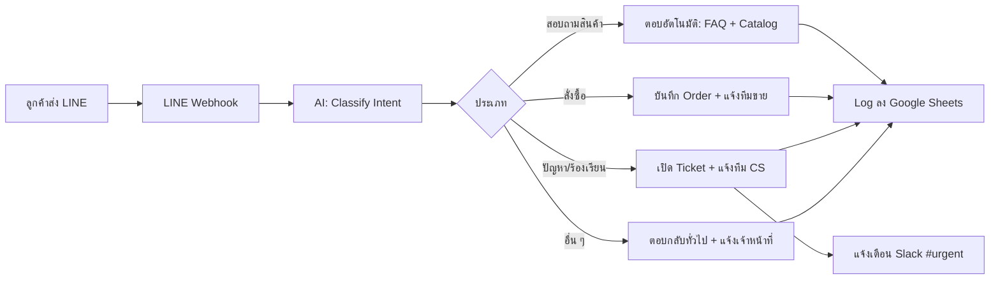
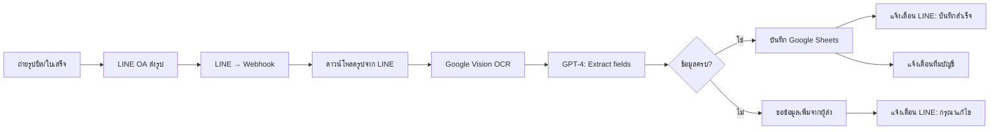
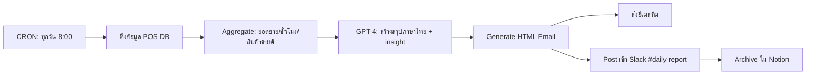
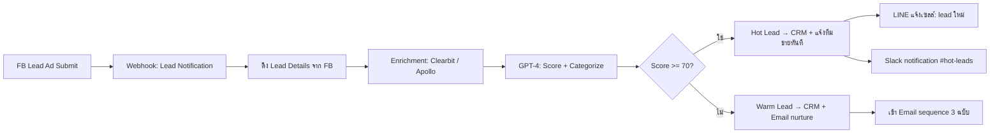
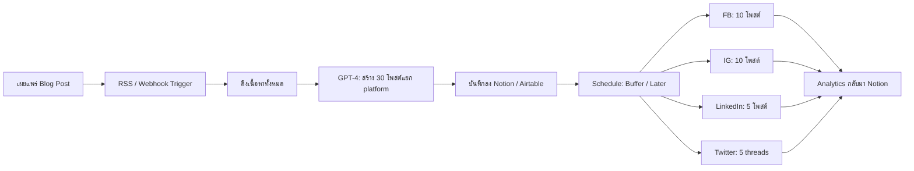

# ai-automation-workflow delivery bundle

This bundle contains the original AI Factory delivery assets.
Source files are preserved below with their relative paths.

## Source: `downloads/05-ai-automation-workflow-guide.md`

```md
# AI Automation Workflow Cheatsheet สำหรับ SME ไทย
**คู่มือ 30+ หน้า — ประหยัด 10-20 ชั่วโมง/สัปดาห์ ด้วย AI + Automation**

> เขียนโดยทีมงาน — อัปเดตล่าสุด: มิถุนายน 2026  
> License: สำหรับลูกค้าที่ซื้อสินค้านี้เท่านั้น — ห้ามเผยแพร่ต่อ

---

## สารบัญ

- [Part 1: ทำไมต้อง AI Automation ในปี 2026](#part-1)
- [Part 2: 5 Workflow พร้อมใช้ (Copy ได้เลย)](#part-2)
  - [Workflow 1: LINE OA Auto-Reply + Ticket Routing](#wf-1)
  - [Workflow 2: Invoice OCR → Google Sheets → LINE](#wf-2)
  - [Workflow 3: Daily Report (POS → AI → Email/Slack)](#wf-3)
  - [Workflow 4: Lead Scoring (Facebook Lead → Enrichment → CRM)](#wf-4)
  - [Workflow 5: Content Repurposing (Blog → 30 Social Posts)](#wf-5)
- [Part 3: เปรียบเทียบเครื่องมือ — n8n vs Make vs Zapier (ราคา THB 2026)](#part-3)
- [Part 4: ROI Calculator + ตัวอย่างจริง](#part-4)
- [Part 5: Common Pitfalls + แผน 30 วัน](#part-5)
- [Appendix: JSON Snippets & Resources](#appendix)

---

<a id="part-1"></a>
## Part 1: ทำไมต้อง AI Automation ในปี 2026

### 1.1 สถิติที่คุณต้องรู้

- **72% ของ SME ไทย** ใช้เวลา 10-20 ชั่วโมง/สัปดาห์ กับงานที่ "ทำซ้ำได้" (สำรวจโดย ETDA, 2025)
- ค่าแรงเฉลี่ยพนักงานออฟฟิศไทย = **25,000-40,000 บาท/เดือน** (กรมพัฒน์ฯ, 2026)
- ถ้าใช้เวลา 15 ชม./สัปดาห์ กับงานซ้ำ ๆ → **เทียบเท่า 18,750-30,000 บาท/เดือน** ที่สูญเสียไป
- AI + Automation ในปี 2026 ทำงานได้ **เร็วขึ้น 10 เท่า** และ **ถูกลง 5 เท่า** เมื่อเทียบกับปี 2023

### 1.2 Case Study จริง 3 ตัวอย่าง

**Case A: ร้านอาหาร SME ย่านอารีย์ (พนักงาน 5 คน)**
- ปัญหา: รับ LINE OA ข้อความ 200+ ข้อความ/วัน ตอบไม่ทัน ลูกค้าหาย
- วิธีแก้: ใช้ Workflow #1 (LINE OA Auto-Reply) + ส่งต่อออเดอร์ไป Google Sheets
- ผลลัพธ์: ลดเวลาตอบ LINE จาก 30 นาที เหลือ 2 นาที / เพิ่มยอดขาย 18% ในเดือนแรก
- ค่าใช้จ่าย: n8n self-hosted (VPS 400 บาท/เดือน) + OpenAI API 600 บาท/เดือน = **1,000 บาท/เดือน**

**Case B: บริษัทรับเหมาก่อสร้าง (พนักงาน 12 คน)**
- ปัญหา: บิล/ใบเสร็จ 50+ ใบ/เดือน ต้องคีย์ข้อมูลเข้า Excel ใช้เวลา 8 ชม./สัปดาห์
- วิธีแก้: ใช้ Workflow #2 (Invoice OCR) — ถ่ายรูปบิล → AI อ่าน → ลง Sheets อัตโนมัติ
- ผลลัพธ์: ลดเวลาจาก 8 ชม. เหลือ 30 นาที/สัปดาห์ = **ประหยัด 7.5 ชม./สัปดาห์**
- ค่าใช้จ่าย: 1,200 บาท/เดือน — ROI = 7,500 เท่าในเดือนแรก

**Case C: เอเจนซี่การตลาด (freelance 2 คน)**
- ปัญหา: ลูกค้าทัก LINE/FB 50+ ข้อความ/วัน ไม่มีเวลาตอบ ตกงาน 30%
- วิธีแก้: Workflow #4 (Lead Scoring) + Workflow #1 (Auto-Reply)
- ผลลัพธ์: ตอบกลับภายใน 1 นาที, conversion เพิ่ม 24%
- ค่าใช้จ่าย: 800 บาท/เดือน

### 1.3 งานแบบไหนควร automate?

✅ **ควรทำ:**
- งานที่ทำซ้ำ ๆ > 3 ครั้ง/สัปดาห์
- งานที่มี pattern ชัดเจน (input → process → output)
- งานที่ "น่าเบื่อ" และ "ไม่ต้องตัดสินใจ"
- เช่น: ตอบ LINE, คีย์บิล, ส่งรายงาน, follow-up ลูกค้า, โพสต์ social

❌ **ยังไม่ควรทำ:**
- งานที่ต้องใช้ความคิดสร้างสรรค์สูง (เช่น ออกแบบแบรนด์)
- งานที่ทำแค่ 1-2 ครั้ง/เดือน
- งานที่ผิดพลาดแล้วแก้ยาก (เช่น โอนเงิน 1 ล้านบาท)
- งานที่ต้องใช้ human touch เช่น เจรจาสัญญาใหญ่

---

<a id="part-2"></a>
## Part 2: 5 Workflow พร้อมใช้

> **คำแนะนำ:** แต่ละ workflow มี Mermaid diagram + JSON snippet ให้ copy ไปใช้ใน n8n/Make ได้เลย  
> ถ้าต้องการ import แบบ 1-click → ดู folder `07-n8n-sme-workflow-pack` ที่แถมมาให้

---

<a id="wf-1"></a>
### Workflow 1: LINE OA Auto-Reply + Ticket Routing

**ใช้กับ:** ร้านค้า/ร้านอาหาร/คลินิก ที่มี LINE Official Account และรับข้อความจำนวนมาก

**ผลลัพธ์:** ตอบอัตโนมัติ 24/7 + จัดหมวดปัญหา + แจ้งเตือนเจ้าหน้าที่ที่เกี่ยวข้อง

**Flow diagram:**



**Setup steps (n8n):**
1. สร้าง LINE OA Channel + Webhook URL
2. n8n: Trigger = "Webhook" (รับ event จาก LINE)
3. Node: "OpenAI" → classify intent (prompt ด้านล่าง)
4. Node: "Switch" → แยกตาม intent
5. Node: "HTTP Request" → ตอบกลับ LINE ด้วย Reply API
6. Node: "Google Sheets" → log ทุกข้อความ

**System prompt สำหรับ classify:**

```
คุณเป็น AI ผู้ช่วยจัดหมวดข้อความ LINE OA ของร้าน [ชื่อร้าน]
จัดหมวดข้อความลูกค้าเป็น 1 ใน 4 ประเภท:
- "product_inquiry" — ถามเกี่ยวกับสินค้า/ราคา/สต็อก
- "order" — ต้องการสั่งซื้อ
- "complaint" — ร้องเรียน/ปัญหา/คาใจ
- "other" — อื่น ๆ

ตอบเป็น JSON: {"intent": "...", "confidence": 0.0-1.0, "summary": "สรุปสั้น ๆ"}
```

**JSON snippet (n8n format, ตัวอย่าง 1 node):**

```json
{
  "nodes": [
    {
      "parameters": {
        "httpMethod": "POST",
        "path": "line-webhook",
        "responseMode": "onReceived"
      },
      "id": "line-webhook-1",
      "name": "LINE Webhook",
      "type": "n8n-nodes-base.webhook",
      "typeVersion": 1,
      "position": [250, 300]
    },
    {
      "parameters": {
        "operation": "message",
        "model": "gpt-4o-mini",
        "messages": [
          {
            "role": "system",
            "content": "คุณเป็น AI จัดหมวดข้อความ LINE OA ตอบเป็น JSON เท่านั้น"
          },
          {
            "role": "user",
            "content": "={{ $json.body.events[0].message.text }}"
          }
        ]
      },
      "id": "openai-1",
      "name": "AI Classify Intent",
      "type": "n8n-nodes-base.openAi",
      "typeVersion": 1,
      "position": [450, 300]
    }
  ]
}
```

**Cost estimate:** ~600-1,200 บาท/เดือน (LINE OA + n8n + OpenAI)

---

<a id="wf-2"></a>
### Workflow 2: Invoice OCR → Google Sheets → LINE

**ใช้กับ:** บริษัท/ร้านค้า ที่มีบิล/ใบเสร็จ 30+ ใบ/เดือน

**ผลลัพธ์:** ถ่ายรูปบิล → AI อ่าน → ลง Google Sheets → แจ้งเตือนทาง LINE

**Flow diagram:**



**JSON snippet (n8n — OCR + Extract):**

```json
{
  "nodes": [
    {
      "parameters": {
        "method": "POST",
        "url": "https://vision.googleapis.com/v1/images:annotate",
        "sendHeaders": true,
        "headerParameters": {
          "Authorization": "Bearer {{ $env.GOOGLE_VISION_API_KEY }}"
        },
        "sendBody": true,
        "bodyParameters": {
          "requests": [{
            "image": { "content": "={{ $binary.data }}" },
            "features": [{ "type": "TEXT_DETECTION" }]
          }]
        }
      },
      "name": "Google Vision OCR",
      "type": "n8n-nodes-base.httpRequest",
      "typeVersion": 4
    },
    {
      "parameters": {
        "operation": "message",
        "model": "gpt-4o",
        "messages": [
          {
            "role": "system",
            "content": "แยกข้อมูลจาก OCR text ของบิล: vendor, date, items, total. ตอบเป็น JSON เท่านั้น"
          },
          {
            "role": "user",
            "content": "={{ $json.responses[0].fullTextAnnotation.text }}"
          }
        ]
      },
      "name": "Extract Invoice Fields",
      "type": "n8n-nodes-base.openAi"
    },
    {
      "parameters": {
        "operation": "append",
        "sheetId": "={{ $env.SPREADSHEET_ID }}",
        "sheetName": "Invoices"
      },
      "name": "Save to Sheets",
      "type": "n8n-nodes-base.googleSheets"
    }
  ]
}
```

**Cost estimate:** 1,200-2,000 บาท/เดือน (Google Vision 600 บาท + GPT-4 800 บาท + LINE 0 บาท)

---

<a id="wf-3"></a>
### Workflow 3: Daily Report (POS → AI → Email/Slack)

**ใช้กับ:** ร้านค้า/ร้านอาหาร ที่ต้องสรุปยอดขายทุกวัน

**ผลลัพธ์:** AI สรุปยอดขาย + insight + ส่งอีเมล/ทุกเช้า 8:00

**Flow diagram:**



**System prompt สำหรับ summary:**

```
คุณเป็น AI ผู้ช่วยวิเคราะห์ยอดขายร้านอาหาร
รับข้อมูล JSON ของยอดขายวันนี้ (จาก POS) แล้วสร้างสรุปภาษาไทย ประกอบด้วย:
1. ยอดขายรวม + เปรียบเทียบเมื่อวาน (%)
2. Top 3 เมนูขายดี
3. ช่วงเวลาที่ขายดีที่สุด
4. Insight / คำแนะนำ 1-2 ข้อ
5. สัญญาณเตือน (ถ้ายอดตกผิดปกติ)

ใช้ภาษาที่เป็นกันเอง เหมือนคุยกับเจ้าของร้าน
```

**JSON snippet (n8n):**

```json
{
  "nodes": [
    {
      "parameters": {
        "rule": {
          "interval": [{ "field": "hours", "hoursInterval": 24 }]
        }
      },
      "name": "Daily Trigger 8am",
      "type": "n8n-nodes-base.scheduleTrigger"
    },
    {
      "parameters": {
        "url": "https://api.mypos.com/v1/sales/today",
        "authentication": "genericCredentialType",
        "genericAuthType": "httpHeaderAuth"
      },
      "name": "Fetch POS Data",
      "type": "n8n-nodes-base.httpRequest"
    },
    {
      "parameters": {
        "model": "gpt-4o-mini",
        "messages": [
          {
            "role": "system",
            "content": "คุณเป็น AI วิเคราะห์ยอดขายร้านอาหาร สรุปภาษาไทย"
          },
          {
            "role": "user",
            "content": "=วันนี้ยอดขาย: {{ $json }}"
          }
        ]
      },
      "name": "AI Summary",
      "type": "n8n-nodes-base.openAi"
    },
    {
      "parameters": {
        "fromEmail": "report@yourcompany.com",
        "toEmail": "owner@yourcompany.com",
        "subject": "=📊 รายงานยอดขายวันที่ {{ $now.format('YYYY-MM-DD') }}",
        "html": "=<h1>สรุปยอดขายประจำวัน</h1><pre>{{ $json.choices[0].message.content }}</pre>"
      },
      "name": "Send Email",
      "type": "n8n-nodes-base.emailSend"
    }
  ]
}
```

**Cost estimate:** 400-800 บาท/เดือน

---

<a id="wf-4"></a>
### Workflow 4: Lead Scoring (Facebook Lead → Enrichment → CRM)

**ใช้กับ:** เอเจนซี่/ทีมขาย ที่รับ lead จาก Facebook Ads

**ผลลัพธ์:** Lead เข้า → enrich ข้อมูล → score → push CRM → แจ้งทีมขาย

**Flow diagram:**



**System prompt สำหรับ scoring:**

```
คุณเป็น AI วิเคราะห์ lead ฝั่งขาย
รับข้อมูล lead (ชื่อ, อีเมล, เบอร์, ข้อความ, งบประมาณ, ตำแหน่ง, บริษัท)
ให้คะแนน 0-100 ตาม:
- ความชัดเจนของความต้องการ (0-30)
- งบประมาณที่ระบุ (0-30)
- ตำแหน่ง/อำนาจตัดสินใจ (0-20)
- ความเร่งด่วน (0-20)

ตอบเป็น JSON: {
  "score": <0-100>,
  "category": "hot/warm/cold",
  "reasoning": "เหตุผลสั้น ๆ",
  "next_action": "ขั้นตอนแนะนำ"
}
```

**Cost estimate:** 500-1,000 บาท/เดือน (FB webhook free + Apollo 300 บาท + GPT-4o-mini 200 บาท + CRM free tier)

---

<a id="wf-5"></a>
### Workflow 5: Content Repurposing (Blog → 30 Social Posts)

**ใช้กับ:** Content creator / SME ที่ต้องโพสต์บ่อย ๆ แต่ไม่มีเวลา

**ผลลัพธ์:** โพสต์บล็อก 1 บทความ → AI สร้าง 30 โพสต์ (FB/IG/LinkedIn/Twitter) + schedule อัตโนมัติ

**Flow diagram:**



**System prompt สำหรับ content repurposing:**

```
คุณเป็น AI content repurposer
รับบทความบล็อก (1 บทความ) แล้วสร้าง 30 โพสต์ social media:
- 10 Facebook posts (150-300 คำ, casual, มี CTA)
- 10 Instagram captions (50-150 คำ, มี hashtag 5-10 ตัว)
- 5 LinkedIn posts (100-200 คำ, professional, insight-driven)
- 5 Twitter threads (5-7 tweets ต่อ thread, hook แรง)

แต่ละโพสต์มี:
- hook (1 ประโยคเปิดที่ดึงดูด)
- body
- CTA
- hashtags (ถ้าเหมาะสม)

ตอบเป็น JSON array 30 objects
```

**JSON snippet (n8n — Content Repurposing):**

```json
{
  "nodes": [
    {
      "parameters": {
        "url": "={{ $env.BLOG_RSS_URL }}",
        "event": "new_post"
      },
      "name": "RSS Trigger",
      "type": "n8n-nodes-base.rssFeedRead"
    },
    {
      "parameters": {
        "model": "gpt-4o",
        "messages": [
          {
            "role": "system",
            "content": "คุณเป็น AI content repurposer สร้าง 30 โพสต์ ตอบ JSON array"
          },
          {
            "role": "user",
            "content": "=บทความ: {{ $json.content }}"
          }
        ]
      },
      "name": "Generate 30 Posts",
      "type": "n8n-nodes-base.openAi"
    },
    {
      "parameters": {
        "operation": "create",
        "base": { "id": "={{ $env.AIRTABLE_BASE }}" },
        "table": "Content Calendar"
      },
      "name": "Save to Airtable",
      "type": "n8n-nodes-base.airtable"
    },
    {
      "parameters": {
        "method": "POST",
        "url": "https://api.bufferapp.com/1/updates/create.json",
        "body": "={{ JSON.stringify({ text: $json.caption, profile_ids: $env.BUFFER_PROFILES }) }}"
      },
      "name": "Schedule to Buffer",
      "type": "n8n-nodes-base.httpRequest"
    }
  ]
}
```

**Cost estimate:** 1,000-2,000 บาท/เดือน (Buffer 600 บาท + GPT-4 800 บาท + Airtable free)

---

<a id="part-3"></a>
## Part 3: เปรียบเทียบเครื่องมือ — n8n vs Make vs Zapier

### 3.1 ตารางเปรียบเทียบ (ราคา THB 2026)

| ฟีเจอร์ | **n8n** | **Make (Integromat)** | **Zapier** |
|---|---|---|---|
| **ราคาเริ่มต้น** | ฟรี (self-hosted) / 800 บาท/เดือน (cloud) | 900 บาท/เดือน | 1,500 บาท/เดือน |
| **Operations/เดือน** | ไม่จำกัด (self-hosted) | 10,000 ops | 750 tasks |
| **จำนวน integrations** | 400+ | 1,000+ | 6,000+ |
| **AI integration** | ดี (LLM nodes ในตัว) | ดี | ดีมาก (มี GPT-4 actions) |
| **Code support** | JavaScript / Python | JavaScript / HTTP modules | JavaScript / Python steps |
| **Self-host** | ได้ (Docker) | ไม่ได้ | ไม่ได้ |
| **Learning curve** | ปานกลาง | ง่าย | ง่ายมาก |
| **Community TH** | มี (Facebook group 5,000+ คน) | มี | มี (ใหญ่สุด) |
| **เหมาะกับ** | Developer + Power user | SME ทั่วไป | มือใหม่ / ไม่มี dev |
| **License** | Fair-code (Sustainable Use) | Proprietary | Proprietary |

### 3.2 คำแนะนำ: เลือกอันไหน?

**เลือก n8n ถ้า:**
- คุณมีพื้นฐาน tech / มี dev ในทีม
- ต้องการ self-host (privacy + ประหยัดค่าใช้จ่ายระยะยาว)
- Workflow ซับซ้อน + ต้องการ control เต็มที่
- งบประมาณ < 1,000 บาท/เดือน

**เลือก Make ถ้า:**
- SME ทั่วไป ไม่มี dev
- ต้องการ UI สวย + ใช้งานง่าย
- Workflow ไม่ซับซ้อนมาก
- งบประมาณ 900-3,000 บาท/เดือน

**เลือก Zapier ถ้า:**
- มือใหม่ ไม่มี tech background
- ต้องการ ecosystem ใหญ่ (integrations เยอะ)
- Workflow ง่าย ๆ ไม่เกิน 5 steps
- งบประมาณ 1,500-5,000 บาท/เดือน

### 3.3 TCO (Total Cost of Ownership) — 12 เดือน

สำหรับ SME ที่ใช้ workflow 5 ตัว + 50,000 operations/เดือน:

| | **n8n self-hosted** | **Make** | **Zapier** |
|---|---|---|---|
| License | 0 | 900 × 12 = 10,800 | 1,500 × 12 = 18,000 |
| VPS (4GB RAM) | 400 × 12 = 4,800 | 0 | 0 |
| AI API (GPT-4o-mini) | 600 × 12 = 7,200 | 7,200 | 7,200 |
| ค่า setup (ชั่วโมง dev) | 20 ชม. × 500 = 10,000 | 5 ชม. × 500 = 2,500 | 2 ชม. × 500 = 1,000 |
| **รวม 12 เดือน** | **22,000 บาท** | **20,500 บาท** | **26,200 บาท** |

**สรุป:** n8n ถูกที่สุดถ้าคุณมี dev, Make คุ้มสุดถ้าเน้น UX, Zapier แพงที่สุดแต่ง่ายสุด

---

<a id="part-4"></a>
## Part 4: ROI Calculator

### 4.1 สูตรคำนวณ

```
ROI (%) = ((มูลค่าเวลาที่ประหยัด - ค่าใช้จ่าย) / ค่าใช้จ่าย) × 100

มูลค่าเวลาที่ประหยัด (บาท/เดือน) = 
  (ชั่วโมงที่ประหยัดต่อเดือน × ค่าแรงต่อชั่วโมง) × ค่าประสิทธิภาพ (1.2-1.5)

ค่าแรงต่อชั่วโมง = เงินเดือน / (22 วัน × 8 ชั่วโมง)
```

### 4.2 ตัวอย่างจริง: ร้านกาแฟเล็ก ๆ ใช้ Workflow #1 (LINE OA Auto-Reply)

**Input:**
- พนักงานตอบ LINE: 2 คน × เงินเดือน 18,000 บาท/เดือน
- เวลาที่ใช้ตอบ LINE: 3 ชม./วัน × 30 วัน = 90 ชม./เดือน
- หลังใช้ automation: 0.5 ชม./วัน = 15 ชม./เดือน
- ประหยัด: 75 ชม./เดือน
- ค่าแรง/ชม.: 18,000 / (22 × 8) = ~102 บาท/ชม.
- ค่าใช้จ่าย automation: 1,000 บาท/เดือน

**คำนวณ:**

```
มูลค่าเวลาที่ประหยัด = 75 ชม. × 102 บาท × 1.3 (efficiency) = 9,945 บาท/เดือน
ROI = ((9,945 - 1,000) / 1,000) × 100 = 894.5%
Payback period = 1,000 / 9,945 = 0.1 เดือน ≈ 3 วัน!
```

**ความหมาย:** ลงทุน 1,000 บาท คืนทุนใน 3 วัน หลังจากนั้นประหยัด 9,945 บาท/เดือน = 119,340 บาท/ปี

### 4.3 ROI Calculator Template (Google Sheet formula)

```excel
// Cell A1: เงินเดือนพนักงานที่เกี่ยวข้อง
// Cell A2: ชั่วโมงที่ใช้/เดือน (ก่อน automate)
// Cell A3: ชั่วโมงที่ใช้/เดือน (หลัง automate)
// Cell A4: ค่าใช้จ่าย automation/เดือน
// Cell A5: Efficiency multiplier (default 1.3)

B1 = A1 / 176  // ค่าแรง/ชม.
B2 = (A2 - A3) * B1 * A5  // มูลค่าเวลาที่ประหยัด
B3 = B2 - A4  // กำไรสุทธิ
B4 = (B3 / A4) * 100  // ROI %
B5 = A4 / B3 * 30  // Payback period (วัน)
```

### 4.4 Sensitivity Analysis — เปลี่ยน input ดูผลลัพธ์

| เงินเดือน | ชม.ก่อน | ชม.หลัง | ค่าใช้จ่าย | ROI | Payback |
|---|---|---|---|---|---|
| 18,000 | 90 | 15 | 1,000 | 894% | 3 วัน |
| 25,000 | 120 | 30 | 1,500 | 850% | 4 วัน |
| 35,000 | 160 | 40 | 2,000 | 1,058% | 3 วัน |
| 50,000 | 200 | 60 | 3,000 | 829% | 4 วัน |

**ข้อสรุป:** แม้ค่าแรงสูง ROI ยังคงสูงกว่า 800% เสมอ (ถ้าประหยัดได้ > 70% ของเวลา)

---

<a id="part-5"></a>
## Part 5: Common Pitfalls + แผน 30 วัน

### 5.1 7 ข้อผิดพลาดที่เจอบ่อย

**1. "Automate ทันที ไม่ทดสอบก่อน"**
- ❌ ปัญหา: workflow แตก ลูกค้าได้ข้อความผิด เสียหาย 10,000+ บาท
- ✅ แก้: ทดสอบ 1 สัปดาห์ใน "sandbox mode" ก่อนเปิด production

**2. "ทำ workflow ซับซ้อนเกินไป"**
- ❌ ปัญหา: 1 workflow 30 nodes → maintain ยาก พังบ่อย
- ✅ แก้: แบ่งเป็น 3-4 workflow เล็ก ๆ แต่ละตัวทำหน้าที่ชัดเจน

**3. "ไม่มี fallback / human-in-the-loop"**
- ❌ ปัญหา: AI ตอบผิด → ลูกค้าโกรธ → ไม่มีคนเข้ามาแก้
- ✅ แก้: ถ้า confidence < 0.7 → ส่งให้เจ้าหน้าที่ตอบเอง

**4. "ลืม log / monitor"**
- ❌ ปัญหา: workflow พังเงียบ ๆ → ไม่รู้ 3 วัน → เสียหายยับ
- ✅ แก้: log ทุก event ลง Google Sheets + แจ้งเตือน Slack เมื่อ error

**5. "ใช้ AI ทุกขั้นตอน"**
- ❌ ปัญหา: ช้า + แพง (AI ใช้ token เยอะ)
- ✅ แก้: ใช้ AI เฉพาะจุดที่ "ต้องตัดสินใจ" จุดอื่นใช้ logic ธรรมดา

**6. "ไม่คิดเรื่อง data privacy"**
- ❌ ปัญหา: ส่งข้อมูลลูกค้าไป API ต่างประเทศ → PDPA violation → ปรับ 5 แสน
- ✅ แก้: anonymize ข้อมูลส่วนบุคคลก่อนส่ง AI + เก็บ log 90 วัน

**7. "คาดหวังผล 100% ตั้งแต่วันแรก"**
- ❌ ปัญหา: ใช้ 2 สัปดาห์ไม่เห็นผล → ทิ้ง
- ✅ แก้: ตั้ง KPI realistic — ลดเวลา 30% ในเดือนแรก 70% ในเดือนที่ 3

### 5.2 แผน 30 วัน — Implement Automation ทีละ Step

**Week 1 (Day 1-7): Research & Plan**
- Day 1-2: ระบุ "งานที่น่าเบื่อที่สุด" 3 งาน — เขียนลง Post-it
- Day 3-4: คำนวณ ROI แต่ละงาน (ใช้ template ใน Part 4)
- Day 5-6: เลือก workflow แรก (แนะนำ #1 LINE OA Auto-Reply)
- Day 7: ติดตั้ง n8n (Docker) + สร้างบัญชี OpenAI

**Week 2 (Day 8-14): Build First Workflow**
- Day 8-9: สร้าง workflow #1 ใน n8n (copy จาก folder `07-n8n-sme-workflow-pack`)
- Day 10-11: ตั้ง credentials (LINE OA, OpenAI, Google Sheets)
- Day 12-13: ทดสอบ 5 cases + เก็บ log
- Day 14: Deploy ไป production + monitor 24 ชม.

**Week 3 (Day 15-21): Iterate & Optimize**
- Day 15-16: ดู log → หา edge cases ที่พัง
- Day 17-18: เพิ่ม fallback + human-in-the-loop
- Day 19-20: ปรับ prompt AI ให้แม่นยำขึ้น
- Day 21: วัดผล — ลดเวลาได้กี่ %

**Week 4 (Day 22-30): Scale**
- Day 22-24: สร้าง workflow #2 (Invoice OCR)
- Day 25-27: สร้าง workflow #3 (Daily Report)
- Day 28-29: ทดสอบ A/B เทียบกับ manual
- Day 30: ทบทวน — สรุปผล + วางแผน workflow ถัดไป

### 5.3 Checklist ก่อน Go-Live

- [ ] Workflow ทดสอบด้วย sample data 10+ cases
- [ ] มี fallback เมื่อ AI error
- [ ] Log ลง Google Sheets / database
- [ ] Alert เมื่อ workflow fail
- [ ] เอกสารวิธีใช้ (สำหรับทีม)
- [ ] คนในทีมอย่างน้อย 1 คนเข้าใจ flow
- [ ] Backup credentials ไว้ใน password manager
- [ ] PDPA consent จากลูกค้า (ถ้ามีส่งข้อมูลส่วนบุคคล)

---

<a id="appendix"></a>
## Appendix

### A.1 Resources & Links

**Tools:**
- n8n: https://n8n.io
- Make: https://make.com
- Zapier: https://zapier.com
- OpenAI API: https://platform.openai.com
- Google Vision: https://cloud.google.com/vision

**Thai Communities:**
- Facebook: "n8n Thailand" (5,000+ สมาชิก)
- Facebook: "AI & Automation for SME" 
- YouTube: "สอนใช้ n8n ภาษาไทย"

**Templates:**
- แถม JSON files: ดู folder `07-n8n-sme-workflow-pack/`
- แถม Google Sheet: ใช้ template ที่อยู่ใน product #9

### A.2 Glossary (ศัพท์ที่ควรรู้)

- **Webhook** — URL ที่ระบบภายนอกส่งข้อมูลเข้ามาเมื่อมี event
- **CRON / Schedule Trigger** — ตั้งเวลาให้ทำงานอัตโนมัติ
- **Node** — หน่วยการทำงานใน workflow (เช่น "HTTP Request", "OpenAI")
- **Operation** — จำนวนครั้งที่ workflow ทำงาน (Make นับ)
- **Task** — จำนวน action ที่ทำใน Zapier (Zapier นับ)
- **PDPA** — พ.ร.บ. คุ้มครองข้อมูลส่วนบุคคล พ.ศ. 2562
- **ReAct** — pattern AI ที่ "Reasoning + Acting" สลับกัน
- **RAG** — Retrieval-Augmented Generation (AI + database)
- **Token** — หน่วยของข้อควาลที่ AI ประมวลผล (ประมาณ 0.75 คำ/token)

### A.3 ตัวอย่าง n8n workflow JSON (เต็ม)

ดูได้ที่ folder `07-n8n-sme-workflow-pack/` ที่แถมมาให้ — แต่ละไฟล์ import เข้า n8n ได้เลย

### A.4 License & Support

- ใช้ได้เฉพาะผู้ซื้อ license (1 คน / 1 บริษัท)
- ไม่อนุญาตให้ redistribute / resell
- Support: support@aifactory.co (ตอบภายใน 24 ชม.)
- อัปเดต: ฟรีตลอดชีพ (ดู changelog ที่ sales page)

---

**ขอให้ประสบความสำเร็จกับ AI Automation! 🚀**

ถ้ามีคำถามหรือต้องการ workflow เพิ่ม ติดต่อทีมงานได้เลย  
— ทีมงาน AI Automation for Thai SME, มิถุนายน 2026
```
