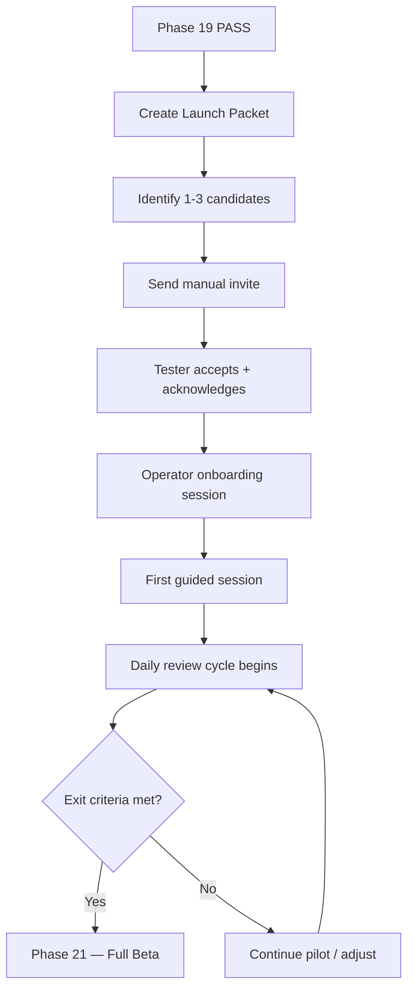

# Beta Launch Policy

> Phase 20 — Limited Beta Launch Packet / Manual Invite / No-Live-Payment Pilot
> **PRODUCTION_READY = false** · **LIVE_PROVIDERS_ENABLED = false** · **NO_LIVE_PAYMENT_MODE = true**

## Scope

This policy governs the limited beta pilot: **1–3 manually invited beta testers**.

### In Scope
- Manual invite only (no self-serve signup)
- Manual onboarding only (operator-led)
- Draft-only AI output (never auto-sent/published)
- Operator approval required for all outward actions
- Daily operator review of all activity
- No-live-payment mode (Stripe sandbox only)
- Feedback collection via in-app form
- Session metrics collection

### Out of Scope
- ❌ Self-serve signup / public registration
- ❌ Live payment processing (Stripe, PayPal, etc.)
- ❌ Automatic email outreach to prospects
- ❌ Automatic publishing of content
- ❌ Production database access
- ❌ Live LLM API calls (beyond read-only testing)
- ❌ Real Google Workspace mutations
- ❌ Real Stripe product creation / charges

## Governance

### Roles

| Role | Responsibility |
|------|---------------|
| **Operator** | Reviews all AI output, approves/rejects actions, manages testers, monitors metrics, triggers kill switch |
| **Beta Tester** | Uses the system, provides feedback, reports bugs |
| **No one else** | No admin, no co-pilot, no second operator during pilot |

### Approval Required For
- ✅ Sending any email (even to own address)
- ✅ Publishing content to any external platform
- ✅ Creating/updating/deleting any external resource
- ✅ Any action that costs money (API calls, LLM usage, etc.)
- ❌ **Always blocked**: live payment, production DB writes, real Google mutations

## Tester Agreement

Each beta tester must acknowledge before first session:

1. **Alpha-quality software** — bugs, instability, data loss possible
2. **No SLA** — no uptime guarantee, no support commitment beyond operator availability
3. **Data may be cleared** — the database may be reset without notice
4. **No live payment** — all financial features are in sandbox/test mode
5. **Feedback required** — testers agree to provide feedback on bugs, confusion, and value
6. **No NDA** — but testers agree not to share screenshots without permission

## Data Policy

- No real customer data in beta
- No PII beyond tester email (stored as SHA-256 hash only)
- No secrets, credentials, or API keys in feedback
- Metrics are anonymized
- Tester session data may be cleared between phases
- No data shared with third parties

## Launch Sequence

## Risk Controls

| Risk | Mitigation |
|------|-----------|
| Live provider accidental call | Provider gates + NO_LIVE_PAYMENT_MODE |
| Data leak between testers | Org-boundary enforcement per request |
| Approval fatigue | Daily limit of 10 pending approvals |
| Kill switch needed | KILL_SWITCH_ALL_EXTERNAL_BETA = true by default |
| Operator unavailable | Pause all testers, close beta until return |
| Production readiness accidentally enabled | Gate requires explicit config change + restart |

## Violations

Any violation of this policy (e.g., bypassing approval, enabling live provider) triggers:
1. Immediate kill switch activation
2. Incident review
3. Possible beta suspension
4. Policy update to prevent recurrence
