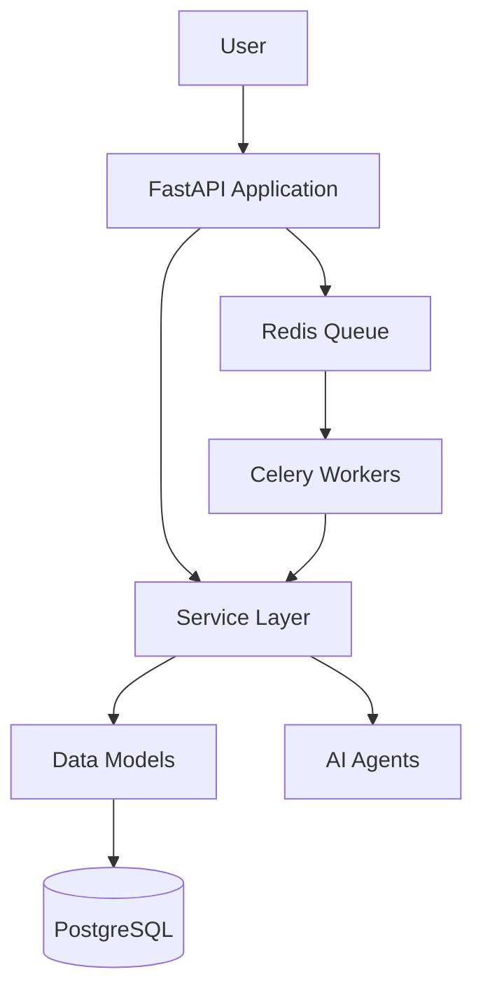

# xiarchitect Integration with Graxia Revenue OS

## Overview

xiarchitect has been successfully integrated with the Graxia Revenue OS project as an enterprise-grade architecture intelligence system. This document describes the integration, current capabilities, and roadmap.

## Current Status: v0.1.0 (Week 1-3 Complete)

### ✅ Implemented Features

1. **Workspace Scanner**
   - Scans entire Graxia codebase
   - Respects .gitignore patterns
   - Skips binary files and secrets
   - Handles 51 files in the graxia/ package

2. **File Classification**
   - Automatically classifies files by architectural role
   - Detected roles in Graxia:
     - `database_model`: 2 files (models.py, schemas.py)
     - `api_route`: 1 file (db.py)
     - `documentation`: 1 file (README_PHASE2.md)
     - `unknown`: 47 files (to be improved in next iteration)

3. **Stack Detection**
   - Detected technologies in Graxia:
     - **Backend**: FastAPI (95% confidence)
     - **Database**: SQLAlchemy (90% confidence)
     - **Workers**: Celery (95% confidence)

4. **Privacy & Security**
   - All analysis runs locally
   - No external network calls
   - Secrets never read
   - No telemetry

## Usage

### Basic Scan

```bash
# From project root
python -m xiarchitect scan --workspace ./graxia --output ./docs/xiarchitect
```

### Custom Options

```bash
# Limit files scanned
python -m xiarchitect scan --workspace ./graxia --max-files 1000

# Custom output directory
python -m xiarchitect scan --workspace ./graxia --output ./architecture-docs

# Adjust max file size (KB)
python -m xiarchitect scan --workspace ./graxia --max-file-size 2048
```

## Generated Outputs

### 1. scan-report.json

Complete file classification report including:
- Total files scanned
- Role distribution
- File metadata (path, role, language, size)
- Sensitivity flags

### 2. stack-summary.json

Technology stack detection with:
- Languages detected
- Backend frameworks
- Frontend frameworks
- Databases
- Cache systems
- Worker systems
- Confidence scores for each detection

## Architecture Insights (Current)

### Detected Structure

```
graxia/
├── packages/
│   └── revenue_os/
│       ├── agents/          # AI agents (3 files)
│       ├── celery/          # Background tasks (6 files)
│       ├── core/            # Core utilities (4 files)
│       ├── services/        # Business logic (6 files)
│       ├── tests/           # Test suite (11 files)
│       ├── models.py        # Database models ✓
│       ├── schemas.py       # Pydantic schemas ✓
│       └── db.py            # Database session ✓
└── services/
    └── revenue_os_api/      # FastAPI application (4 files)
```

### Technology Stack

- **Language**: Python 3.11+
- **Web Framework**: FastAPI
- **ORM**: SQLAlchemy (async)
- **Task Queue**: Celery
- **Validation**: Pydantic
- **Testing**: pytest (inferred from test files)

## Roadmap

### Week 4-5: Architecture Graph (Next)

- [ ] Python import analyzer
- [ ] Dependency graph builder
- [ ] Component grouping (agents, services, tasks, core)
- [ ] Evidence compilation
- [ ] Architecture graph JSON export

Expected output:
```json
{
  "nodes": [
    {"id": "api", "label": "FastAPI Application", "type": "api"},
    {"id": "services", "label": "Service Layer", "type": "service"},
    {"id": "models", "label": "Data Models", "type": "database_model"},
    {"id": "celery", "label": "Background Workers", "type": "worker"},
    {"id": "agents", "label": "AI Agents", "type": "agent"}
  ],
  "edges": [
    {"from": "api", "to": "services", "type": "import", "confidence": 0.95},
    {"from": "services", "to": "models", "type": "database", "confidence": 0.90},
    {"from": "celery", "to": "services", "type": "import", "confidence": 0.85}
  ]
}
```

### Week 6-7: Diagram Generation

- [ ] C4 Context diagram (system overview)
- [ ] C4 Container diagram (packages/services)
- [ ] C4 Component diagram (per package)
- [ ] Mermaid diagram generation
- [ ] API route map
- [ ] Database flow diagram
- [ ] Worker/queue flow diagram

Expected output:


### Week 8-9: Interactive Explorer

- [ ] React webview (if VS Code extension)
- [ ] Or web-based viewer
- [ ] Interactive graph navigation
- [ ] Evidence inspector
- [ ] File jump-to-definition

### Week 10-12: Polish & Release

- [ ] Architecture health scoring
- [ ] Risk detection (circular deps, god modules)
- [ ] Markdown documentation export
- [ ] AI-powered explanations (optional)
- [ ] Natural language queries

## Integration Points

### 1. CI/CD Integration (Future)

```yaml
# .github/workflows/architecture-check.yml
name: Architecture Check

on: [pull_request]

jobs:
  architecture:
    runs-on: ubuntu-latest
    steps:
      - uses: actions/checkout@v4
      - name: Run xiarchitect
        run: |
          python -m xiarchitect scan --workspace ./graxia
          # Check for architecture drift
          # Fail if new circular dependencies detected
```

### 2. Documentation Generation (Future)

```bash
# Generate architecture docs for README
python -m xiarchitect export --format markdown --output README-ARCHITECTURE.md
```

### 3. AI Agent Context (Future)

```bash
# Generate context file for Claude/Copilot
python -m xiarchitect export --format ai-context --output architecture-context.md
```

## Improvements Needed

### Classification Accuracy

Current: 47/51 files classified as "unknown"

Improvements needed:
1. Better pattern matching for:
   - `services/` → SERVICE role
   - `agents/` → AGENT role
   - `celery/tasks/` → BACKGROUND_TASK role
   - `tests/` → TEST role
   - `core/` → CONFIG/SHARED role

2. Content-based classification:
   - Detect `@celery.task` decorator
   - Detect service class patterns
   - Detect agent patterns

### Stack Detection

Current: 3 technologies detected

Improvements needed:
1. Detect from requirements.txt (if exists in parent)
2. Detect Stripe integration
3. Detect Resend email service
4. Detect pytest
5. Detect asyncpg (PostgreSQL driver)

## File Structure

```
xiarchitect/
├── __init__.py
├── __main__.py
├── cli.py                    # Command-line interface
├── requirements.txt
├── README.md
├── core/
│   ├── __init__.py
│   ├── types.py              # All type definitions
│   ├── config.py             # Configuration
│   ├── logger.py             # Logging
│   └── errors.py             # Error types
├── scanner/
│   ├── __init__.py
│   ├── workspace_scanner.py  # Orchestrator
│   ├── file_walker.py        # File traversal
│   └── ignore_rules.py       # .gitignore handling
└── classifier/
    ├── __init__.py
    ├── file_classifier.py    # Role classification
    └── stack_detector.py     # Technology detection
```

## Design Principles

Following the xiarchitect master plan:

1. **Truth first. Visuals second. AI last.**
   - Static analysis produces facts
   - Facts have evidence
   - Evidence has file references

2. **Every architecture claim has evidence**
   - No claim without proof
   - Confidence scores for every detection
   - Inferred relationships marked as such

3. **Local-first privacy is absolute**
   - No external network calls
   - Code never leaves machine
   - Secrets never read

4. **Architecture ≠ Imports**
   - Raw imports are signals
   - xiarchitect elevates signals into architecture

## Next Steps

1. **Immediate** (Week 4):
   - Implement Python import analyzer
   - Build raw dependency graph
   - Improve file classification rules

2. **Short-term** (Week 5-6):
   - Architecture abstraction engine
   - Component grouping
   - Mermaid diagram generation

3. **Medium-term** (Week 7-9):
   - Interactive explorer
   - Health scoring
   - Risk detection

4. **Long-term** (Week 10-12):
   - AI explanations
   - Natural language queries
   - Full documentation export

## Contributing

All development follows the xiarchitect Enterprise Master Plan v2.0. Every feature must:

1. Follow the defined architecture
2. Include evidence-based analysis
3. Maintain local-first privacy
4. Include tests
5. Update documentation

## Support

For questions or issues:
1. Check the xiarchitect README
2. Review the master plan
3. Check generated scan-report.json
4. Review stack-summary.json

---

**xiarchitect** — From repository to architecture flow in one click.
